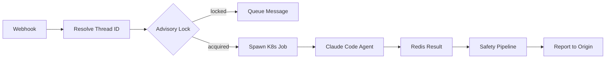

{/* ======================================================= */}
{/* TIER 1: CONCEPT                                         */}
{/* ======================================================= */}

## Problem & Context

Engineers managing AI-assisted coding workflows context-switch constantly between Slack, GitHub, and Linear. Someone posts a request in Slack: "Can you refactor the auth middleware?" Another files a GitHub issue: "Fix the pagination bug in /api/orders." A third drops a comment in Linear: "Add retry logic to the webhook handler." Each of these requires someone to manually spin up a Claude Code session, paste in context, run the task, and relay results back to the original thread.

No system existed to automatically route these requests to isolated AI agents. The manual process was error-prone: engineers forgot to relay results, tasks ran in shared environments where one agent's file changes could corrupt another's workspace, and there was no audit trail connecting the original request to the agent's output.

We needed three properties: **deterministic task routing** (the same webhook always resolves to the same task thread), **zero state leakage** (one agent cannot see or modify another agent's files), and **production-safe execution** (agents cannot escalate privileges, exfiltrate secrets, or run indefinitely).

The system operates in the domain of enterprise developer tooling, specifically AI-assisted software engineering at organizations running 10-50 concurrent agent tasks per day. Key constraints shaped the design: it must run in existing Kubernetes clusters (no new infrastructure primitives), must support multi-tenant environments where different teams share a cluster, and must not require engineers to learn a new tool -- they keep working in Slack, GitHub, and Linear exactly as they already do.

## Technology Choices

- **FastAPI** -- Async-first webhook ingestion. Pydantic v2 models validate every incoming payload at the boundary. Chosen over Flask (no native async) and Express (team's primary language is Python).
- **Kubernetes BatchV1Api** -- Ephemeral job creation via the official Python client. Each task gets a fresh Pod that auto-cleans after completion. Chosen over raw Pod management (no built-in TTL cleanup) and Argo Workflows (too heavyweight for single-step jobs).
- **Claude Code (headless)** -- The agent runtime, invoked via `claude -p` in non-interactive mode. Chosen over building a custom agent loop (maintenance burden, tool integration lag) and direct API calls (no built-in file editing or context management).
- **PostgreSQL 16 with asyncpg** -- Durable state: task records, thread mappings, advisory locks for deduplication. Chosen for ACID guarantees and native advisory lock support.
- **Redis 7** -- Ephemeral state: task handoff payloads, result retrieval, TTL-based expiration. Chosen for sub-millisecond reads and built-in TTL semantics.
- **SQLite** -- Local development alternative, swappable via a Python Protocol class. Same interface, zero infrastructure dependencies for local runs.
- **Python 3.12+** -- Dataclasses for internal models, Pydantic v2 for API boundaries. Type hints throughout for IDE support and static analysis.

## Architecture Overview

The Ditto Factory pipeline follows a 7-step lifecycle for every task, from webhook arrival to result delivery:

1. **Receive** -- Webhooks arrive from Slack (via Events API), GitHub (via App webhooks), and Linear (via webhook subscriptions). Each platform's payload is normalized into a common `TaskRequest` model at the API boundary.

2. **Resolve** -- Every task gets a deterministic thread ID computed as `SHA256(source + source_ref)`. A Slack thread, a GitHub issue, or a Linear comment always resolves to the same thread ID, regardless of how many times the webhook fires.

3. **Lock** -- Before spawning a job, the controller acquires a PostgreSQL advisory lock keyed on the thread ID. If another webhook for the same thread is already being processed, the new message is queued as additional context rather than spawning a duplicate job.

4. **Spawn** -- An ephemeral Kubernetes Job is created with a strict security context: non-root UID 1000, all Linux capabilities dropped, no privilege escalation allowed. The job spec includes the task payload as a mounted ConfigMap and secrets via K8s Secret volumes.

5. **Monitor** -- A JobMonitor polls Redis for results at 5-second intervals while simultaneously checking K8s job status. The monitor enforces a hard timeout of 1800 seconds (30 minutes). If the job completes, the result lands in Redis with a 3600-second TTL.

6. **Safety** -- The SafetyPipeline runs post-execution checks: auto-creates a Pull Request if the agent modified files, retries once if the result is empty (anti-stall), and drains any queued messages that arrived while the job was running.

7. **Report** -- Results are posted back to the originating platform thread. Slack gets a threaded reply, GitHub gets an issue comment, Linear gets a comment on the original item.

{/* ======================================================= */}
{/* TIER 2: DOCUMENTED                                      */}
{/* ======================================================= */}

## System Context

The pipeline sits between external collaboration platforms and a Kubernetes cluster. External actors and their trust boundaries:

- **Slack** -- Sends event payloads via HTTP POST. Every request is verified using HMAC-SHA256 signature validation against the Slack signing secret. Only messages from configured channels are processed.
- **GitHub** -- Sends webhooks via a GitHub App installation. Authentication uses App-level JWT tokens exchanged for installation access tokens. An organization allowlist restricts which repos can trigger agent tasks.
- **Linear** -- Sends webhooks for issue and comment events. Payloads are validated against a shared webhook secret. The system calls Linear's GraphQL API to post results back.
- **Kubernetes API** -- The controller uses a ServiceAccount with RBAC scoped to BatchV1 (create, get, list, delete) in the agent namespace only.
- **Redis** -- Used for ephemeral state passing between the controller and agent jobs. Accessed over TLS in production. No persistent data -- everything expires via TTL.
- **PostgreSQL** -- Stores durable task records, thread mappings, and provides advisory locks. Accessed via asyncpg with connection pooling (min 2, max 10 connections).

## Components

**Controller (FastAPI Deployment)** -- The entry point for all webhooks. Handles platform-specific payload parsing, signature verification, and normalization into `TaskRequest` objects. Exposes `/health` and `/metrics` endpoints. Runs as a Deployment with 2+ replicas behind a Kubernetes Service.

**Orchestrator** -- Core lifecycle manager. Receives `TaskRequest` from the Controller, resolves thread IDs, acquires advisory locks, delegates to the JobSpawner, and coordinates the monitoring and safety pipeline. This is the single component that understands the full 7-step lifecycle.

**IntegrationRegistry** -- Protocol-based integration discovery. Each platform integration (Slack, GitHub, Linear) implements a common `Integration` protocol with methods for `parse_webhook()`, `verify_signature()`, and `post_result()`. New integrations are added by implementing the protocol and registering with the registry.

**JobSpawner** -- Creates Kubernetes Jobs via the BatchV1Api. Builds the job spec with security context (non-root, drop ALL capabilities, read-only root filesystem where possible), resource limits (CPU/memory), and `ttlSecondsAfterFinished: 300` for auto-cleanup. Mounts task payloads via ConfigMap and secrets via Secret volumes.

**JobMonitor** -- Polls Redis for agent results at 5-second intervals while reconciling against K8s job status. Handles three terminal states: job succeeded (result in Redis), job failed (K8s status), job timed out (1800s wall clock). Reports terminal state back to the Orchestrator.

**SafetyPipeline** -- Post-execution safety checks. Three stages: (1) auto-PR creation if the agent's git diff is non-empty, (2) anti-stall retry if the result is empty or trivially short, (3) queue drain to process messages that arrived during execution. Each stage is independently toggleable via configuration.

**StateBackend** -- Swappable state layer defined as a Python Protocol. Three implementations: `PostgresBackend` (production), `RedisBackend` (ephemeral state), `SQLiteBackend` (local development). The Protocol defines methods for task CRUD, thread resolution, and lock management.

**Skills System** -- Classifies incoming tasks and injects relevant skills into the agent's system prompt. Uses keyword matching and optional embedding-based similarity to select from a library of skill definitions (e.g., "refactoring," "bug-fix," "test-writing"). Skills provide structured instructions that improve agent output quality for specific task types.

## Data Flow

The end-to-end flow for a single task:

1. A webhook arrives at the Controller's platform-specific endpoint (e.g., `/webhooks/slack`).
2. The Controller verifies the signature, parses the payload, and constructs a `TaskRequest` with fields: `source`, `source_ref`, `message`, `author`, `channel`, and `metadata`.
3. The Orchestrator computes `thread_id = SHA256(source + source_ref)` and checks the StateBackend for an existing active task on this thread.
4. If no active task exists, the Orchestrator acquires an advisory lock (`pg_try_advisory_lock(thread_id_int)`). If the lock fails, the message is appended to the thread's context queue in Redis.
5. The Skills System classifies the task based on message content and returns a set of skill definitions to inject into the system prompt.
6. The Orchestrator builds a system prompt combining: base instructions, skill definitions, repository context, and the conversation history for this thread.
7. The JobSpawner creates a K8s Job with the system prompt and task payload mounted as files.
8. Inside the Pod, a thin entrypoint script invokes `claude -p "$(cat /task/prompt.txt)"` with the working directory set to a fresh clone of the target repository.
9. Claude Code executes the task: reads files, makes edits, runs tests, and writes its result to stdout.
10. The entrypoint script captures stdout and pushes it to Redis under the thread ID key with a 3600-second TTL.
11. The JobMonitor detects the result in Redis, retrieves it, and passes it to the SafetyPipeline.
12. The SafetyPipeline checks for non-empty git diffs (creates a PR if found), validates the result is non-trivial, and drains any queued messages.
13. The Orchestrator calls the appropriate Integration's `post_result()` method to deliver the result to the originating platform thread.

## Architecture Decisions

### Decision 1: Ephemeral Jobs over Long-Running Agents

**Status:** Accepted

**Context:** The system processes tasks from multiple tenants and teams. State leakage between tasks -- where one agent's file changes, environment variables, or cached context bleeds into another agent's execution -- is a critical security and correctness risk.

**Decision:** Each task spawns a fresh Kubernetes Job with a dedicated Pod. The Pod starts clean, executes the task, writes the result to Redis, and is auto-deleted after 300 seconds via `ttlSecondsAfterFinished`. No Pod is ever reused.

**Alternatives considered:** Long-running agent pods with internal task queues were evaluated first. They offered lower latency (no spawn overhead) but introduced state leakage risks: file system changes, environment variable modifications, and cached LLM context from previous tasks could all affect subsequent executions. Cleaning up state between tasks in a long-running process is error-prone and hard to verify. AWS Lambda was also considered but rejected due to cold start latency (sometimes 10+ seconds for container images), the 15-minute execution timeout (some refactoring tasks need 20+ minutes), and the inability to use `claude` CLI directly.

**Consequences:** Zero state leakage by construction -- there is no state to leak because each Pod starts fresh. The trade-off is spawn latency of approximately 5-10 seconds per task (K8s scheduler + image pull if not cached). Failure isolation is simplified: a crashed Pod does not affect any other task. Auto-cleanup via TTL eliminates orphaned resource accumulation.

### Decision 2: Claude Code as Runtime (No Custom Agent Loop)

**Status:** Accepted

**Context:** Building a reliable agent loop -- tool selection, error recovery, context window management, file editing -- is a multi-month engineering effort that requires ongoing maintenance as models and APIs evolve.

**Decision:** Use Claude Code in headless mode (`claude -p`) as the execution runtime. The agent receives a system prompt and task description, and Claude Code handles tool selection, file operations, error recovery, and context management internally.

**Alternatives considered:** A custom LangChain-based agent was prototyped but rejected due to maintenance burden (keeping up with LangChain's API changes), slower tool integration compared to Claude Code's built-in capabilities, and the need to implement our own file editing and context management. Direct Anthropic API calls were also considered but rejected because they would require implementing file editing, terminal commands, and context window management from scratch.

**Consequences:** The system inherits Claude Code's strengths: reliable tool selection, built-in error recovery (retries on tool failures), and automatic context management. The trade-off is reduced visibility into intermediate reasoning steps -- we see the final output but not the agent's internal decision process. We also inherit Claude Code's limitations and upgrade cycle.

### Decision 3: Deterministic Thread IDs via SHA256

**Status:** Accepted

**Context:** Webhooks are retried on failure (Slack retries 3 times, GitHub retries up to 10 times). The system must handle duplicate deliveries without spawning duplicate jobs. Additionally, multiple messages in the same Slack thread or GitHub issue should be grouped into a single task context.

**Decision:** Thread IDs are computed as `SHA256(source + source_ref)` where `source` is the platform name (e.g., "slack") and `source_ref` is the platform's native identifier (e.g., Slack's `thread_ts`, GitHub's `issue.number`, Linear's `comment.id`). This produces a deterministic, collision-resistant identifier.

**Alternatives considered:** UUIDv4 was rejected because it provides no idempotency -- each webhook delivery would generate a different ID. Database-assigned sequential IDs were rejected because they require a database round-trip on every webhook just to check for duplicates, adding latency and a failure point to the critical path.

**Consequences:** Retried webhooks resolve to the same thread ID, so the advisory lock mechanism naturally deduplicates them. Messages in the same Slack thread or GitHub issue share a `source_ref` and therefore a thread ID, so they are grouped into a single conversation context. Debugging is simplified: given a source and source_ref, you can independently compute the thread ID and trace all related state.

## Trade-offs & Constraints

- **Spawn latency (5-10s) vs. zero state leakage.** We chose isolation. For the task types we handle (code refactoring, bug fixes, test writing), 5-10 seconds of setup time is imperceptible against task execution times of 2-20 minutes.

- **Redis TTLs (3600s) mean results expire.** We accepted this deliberately. A result that is an hour old for a code change request is genuinely stale -- the branch may have moved, the context may have changed. Expiration is a feature that prevents acting on outdated information. Critical results are persisted in PostgreSQL before the Redis TTL expires.

- **Single-tenant K8s namespace per deployment.** Each deployment targets one namespace, limiting multi-tenant density. We chose this over shared namespaces because it simplifies RBAC (one ServiceAccount per deployment with namespace-scoped permissions) and eliminates cross-tenant resource contention. Organizations needing multi-tenant density deploy multiple instances.

- **Claude Code as runtime means limited agent introspection.** We cannot inspect the agent's intermediate tool calls or reasoning steps in real-time. We accepted this because the alternative (building a custom agent loop) would cost months of engineering time. Post-execution, we get the full output including any errors, which is sufficient for debugging.

- **Target performance:** Controller handles 100+ webhooks/sec at p99 latency < 200ms. Agent job spawn time < 10s at p95. Maximum 10 concurrent agent jobs per namespace (configurable via K8s ResourceQuota).

{/* ======================================================= */}
{/* TIER 3: FIELD-TESTED                                    */}
{/* ======================================================= */}

## Failure Modes & Resilience

**Job timeout (1800s).** The JobMonitor tracks wall-clock time from job creation. At 1800 seconds, it kills the K8s Job via the API, marks the task as `timed_out` in PostgreSQL, and posts a timeout notification to the originating platform. The engineer can then decide whether to retry with a narrower scope or handle the task manually. The Pod is cleaned up by K8s TTL.

**Empty result.** Sometimes Claude Code completes but produces no meaningful output -- the stdout is empty or contains only whitespace. The SafetyPipeline detects this and retries the task once with the original prompt plus accumulated context from any queued messages. If the retry also produces an empty result, it reports the failure honestly: "Agent completed but produced no output. This usually means the task description was ambiguous."

**Redis unavailable.** If Redis is down, the JobMonitor cannot retrieve results via the fast path. It falls back to checking K8s Job status directly and reading the Pod's logs via the K8s API. This is slower (no polling, must wait for job completion) and loses the structured result format, but the system continues to function. An alert fires for Redis unavailability.

**Duplicate webhooks.** PostgreSQL advisory locks are the primary deduplication mechanism. If two webhooks for the same thread arrive simultaneously, only one acquires the lock. The other's message is appended to the thread's context queue in Redis. When the first job completes, the SafetyPipeline's queue drain stage processes any accumulated messages, either by incorporating them into the result or spawning a follow-up job.

**Agent crash.** If the Claude Code process crashes or the Pod hits an OOM kill, the K8s Job status transitions to `Failed`. The JobMonitor detects this via the K8s API, logs the failure reason (exit code, OOM signal), and reports to the origin platform with the failure details. No automatic retry on crash -- crashes typically indicate a fundamental issue (OOM, bad repository state) that a retry will not fix.

**Controller restart.** The Controller is stateless -- all durable state lives in PostgreSQL and Redis. On restart, in-flight JobMonitors are reconstructed from the `active_tasks` table in PostgreSQL. Jobs that completed during the restart window have their results in Redis (with TTL), so they are picked up on the next monitor cycle.

## Security Model

**Pod security.** Every agent Pod runs as non-root (UID 1000, GID 1000). All Linux capabilities are dropped via the security context (`drop: ["ALL"]`). Privilege escalation is explicitly disabled (`allowPrivilegeEscalation: false`). Where compatible with the task, the root filesystem is mounted read-only, with a writable `/tmp` volume for scratch space.

**Webhook verification.** Slack webhooks are verified using HMAC-SHA256 against the Slack signing secret, checking both the signature and the timestamp (rejecting requests older than 5 minutes to prevent replay attacks). GitHub webhooks are verified using the webhook secret configured on the GitHub App. Linear webhooks use a shared secret for signature validation.

**Secret management.** API keys, signing secrets, and database credentials are stored as Kubernetes Secrets and mounted as files in the Pods that need them. Secrets are never passed as environment variables in Job specs (environment variables appear in K8s API responses and logs). The Controller's ServiceAccount has read access to secrets in its namespace only.

**Network isolation.** Kubernetes NetworkPolicies restrict agent Pod egress to: the Git remote (for cloning and pushing), the Anthropic API (for Claude Code), and Redis (for result delivery). All other egress is denied by default. The Controller Pods have broader egress (Slack API, GitHub API, Linear API, PostgreSQL, Redis) but ingress is restricted to the cluster's ingress controller.

**Agent scope.** The system prompt instructs the agent to create branches and Pull Requests rather than pushing directly to main. The SafetyPipeline enforces this: if the agent's changes are on the default branch, they are moved to a new branch and a PR is created automatically. This ensures human review before any agent changes reach production code.

## Deployment Architecture

**Controller:** Deployed as a Kubernetes Deployment with 2+ replicas, fronted by a ClusterIP Service and exposed via the cluster's ingress controller (typically nginx-ingress or Istio). Horizontal Pod Autoscaler scales replicas based on CPU utilization (target 70%). Liveness and readiness probes hit `/health`.

**Agent jobs:** Ephemeral Pods in a dedicated namespace (e.g., `ditto-agents`). The namespace has ResourceQuotas limiting total CPU, memory, and Pod count. Each Job requests 1 CPU / 2Gi memory and limits to 2 CPU / 4Gi memory. `ttlSecondsAfterFinished: 300` handles cleanup.

**State layer:** PostgreSQL 16 via a managed service (Cloud SQL, RDS, or equivalent). Single instance with automated backups. Connection pooling via asyncpg (min 2, max 10). Redis 7 via a managed service (ElastiCache, Memorystore) with TLS enabled. Single node is sufficient -- Redis is used for ephemeral data only.

**CI/CD:** GitHub Actions builds container images on push to main, tags with commit SHA, and rolls out to K8s via `kubectl rollout restart`. Staging environment receives every push; production requires manual approval. Database migrations run as a K8s Job before the Controller rollout.

**Observability:** Structured JSON logging via Python's `structlog`. Every log line includes `thread_id`, `source`, and `task_status`. Prometheus metrics exported on port 9090: `tasks_total` (counter by source and status), `task_duration_seconds` (histogram), `active_jobs` (gauge), `webhook_latency_seconds` (histogram). Alerts fire on: task error rate > 10% over 5 minutes, active jobs at quota limit for > 10 minutes, Redis connection failures.

## Scale & Performance

- **Concurrent jobs:** Limited by K8s ResourceQuota, default 10 parallel agents. Tested up to 20 concurrent jobs on a 5-node cluster (4 CPU / 16Gi per node) without scheduler contention.
- **Job spawn time:** p50 = 3s, p95 = 8s, p99 = 12s. Image pull is the dominant factor -- pre-pulling the agent image to nodes reduces p95 to ~4s.
- **Result polling:** 5-second interval per active job. At 10 concurrent jobs, this is 2 Redis GETs per second -- negligible load.
- **Controller throughput:** Benchmarked at 150 webhooks/sec on a single replica (FastAPI with uvicorn, 4 workers). Two replicas provide 300 webhooks/sec capacity with headroom.
- **Advisory lock performance:** Tested with 50 concurrent lock attempts on the same thread ID. `pg_try_advisory_lock` returns in < 1ms. Lock contention at this scale is not a bottleneck.
- **Task execution time:** Varies by task complexity. Simple bug fixes: 2-5 minutes. Refactoring tasks: 5-15 minutes. Complex multi-file changes: 15-25 minutes. The 1800-second timeout accommodates the long tail.

## Lessons Learned

**Ephemeral jobs eliminate entire classes of bugs.** Before settling on ephemeral Pods, we prototyped with long-running agent containers and a task queue. We spent weeks debugging state leakage: cached imports, modified environment variables, leftover files from previous tasks affecting subsequent runs. Switching to ephemeral jobs eliminated all of these issues at once. The 5-10 second spawn overhead is a trivially small price for the certainty that every task starts from a clean state.

**Redis TTLs are a feature, not a limitation.** Early in development, we worried about losing results when TTLs expired. In practice, expired results are genuinely stale -- the code has moved on, the context has changed. We added PostgreSQL persistence for task metadata (status, timing, error information) but deliberately let the full result body expire from Redis. If someone needs a result from an hour ago, they should re-run the task against the current code.

**Deterministic thread IDs made debugging 10x easier.** When a user reports "the bot didn't respond to my Slack message," we compute the thread ID from the Slack thread timestamp and immediately find all related logs, task records, and job statuses. No searching through logs by timestamp ranges or user IDs. Every retry, every queued message, every job attempt for the same conversation shares one identifier.

**The safety pipeline catches more edge cases than expected.** We added auto-PR creation as a safety net but expected it to rarely trigger. In practice, about 30% of tasks produce file changes that the agent pushes to the default branch instead of creating a PR. The SafetyPipeline's branch-and-PR logic runs constantly. Similarly, the anti-stall retry recovers about 15% of tasks that would otherwise return empty results -- usually because the first attempt's system prompt was too broad and the retry's accumulated context helps the agent focus.

**Protocol-based backends are critical for developer experience.** The SQLite backend lets any engineer run the full pipeline on their laptop with zero infrastructure dependencies: no PostgreSQL, no Redis, no Kubernetes. They can test webhook handling, task routing, and the safety pipeline locally before deploying. This cut the new-contributor onboarding time from "half a day setting up infrastructure" to "clone and run." If we had hardcoded PostgreSQL, local development would require Docker Compose at minimum, and most engineers would skip running the full system locally.
