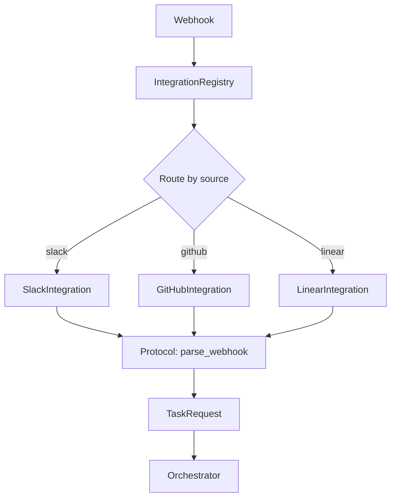

{/* ======================================================= */}
{/* TIER 1: CONCEPT                                         */}
{/* ======================================================= */}

## Problem & Context

AI agent systems that operate in enterprise environments rarely receive tasks from a single channel. Engineers file GitHub issues, product managers drop requests in Slack threads, and project leads create Linear tickets — all expecting the agent to pick up work and report back in the same place it was asked.

The naive approach is a growing `if/elif` chain in your webhook handler: one branch for Slack, another for GitHub, another for Linear. This works for exactly one integration. By the third, you have a tangled mess where adding Linear support requires touching Slack-specific code paths, and testing any of it requires live platform connections.

What you actually need is a clean separation between "what to do" (orchestration) and "where it came from" (integration). The orchestrator should never know or care whether a task originated from a Slack mention or a GitHub issue comment. Each integration should be self-contained: it knows how to parse its platform's webhooks, gather context, and report results — and nothing else.

The constraints that shaped this design:

- **Testable without real connections.** You cannot require a Slack workspace to run your test suite. Integration implementations must be replaceable with in-memory fakes.
- **Hot-addable integrations.** Deploying a new integration should not require changes to the router, the orchestrator, or any existing integration.
- **Type-safe at development time.** If an integration is missing a required method, the developer should know before they push — not when a webhook hits production and throws `AttributeError`.

This architecture emerged from building Ditto Factory, an enterprise AI agent platform that processes tasks from Slack, GitHub, and Linear simultaneously. The patterns here are extracted from production code handling hundreds of webhooks per day.

## Technology Choices

- **Python 3.12+ with `typing.Protocol`** — Structural subtyping (PEP 544) gives us interface contracts without inheritance coupling. Any class that implements the right methods satisfies the protocol. Mypy enforces it at development time.
- **FastAPI** — Async-native, excellent for webhook handling where you need immediate acknowledgment followed by background processing. Dynamic route registration lets integrations mount their own endpoints at startup.
- **Pydantic v2** — Webhook payload validation with meaningful error messages. V2's Rust-backed core handles parsing in microseconds.
- **HMAC-SHA256 / JWT / API keys** — Each platform has its own auth mechanism. Slack uses HMAC signing secrets, GitHub uses App JWTs, Linear uses API keys. No single auth strategy fits all three.
- **SHA256 for thread ID derivation** — Deterministic, platform-agnostic conversation identity. `SHA256(source + source_ref)` produces the same thread ID regardless of how many times a webhook is delivered.

## Architecture Overview

The system is built around a 4-method Protocol interface. Every integration — whether it talks to Slack, GitHub, or a platform that doesn't exist yet — must implement these four methods:

1. **`parse_webhook(request) -> TaskRequest`** — Extracts a structured task from the raw webhook payload. Normalizes platform-specific formats into a common `TaskRequest` model.
2. **`fetch_context(task) -> str`** — Gathers additional context from the platform. For Slack, this means pulling the conversation thread. For GitHub, it means fetching the full issue body and comments.
3. **`report_result(task, result) -> None`** — Sends the agent's output back to the originating platform. Posts a Slack message, adds a GitHub comment, or updates a Linear issue.
4. **`acknowledge(request) -> Response`** — Returns an immediate HTTP response to the webhook sender. This is critical: Slack retries after 3 seconds, so you must acknowledge before doing any real work.

An `IntegrationRegistry` sits between the FastAPI router and the integrations. At startup, it discovers configured integrations, registers their webhook routes, and at request time, routes incoming webhooks to the correct handler.



The key insight: the Orchestrator only ever sees `TaskRequest` objects. It has no imports from `slack_sdk`, no knowledge of GitHub webhook signatures, no awareness that Linear uses GraphQL. All of that is encapsulated behind the Protocol boundary.

{/* ======================================================= */}
{/* TIER 2: DOCUMENTED                                      */}
{/* ======================================================= */}

## System Context

The integration system sits at the boundary between external platforms and the internal agent orchestrator.

**External actors:**
- **Slack API** — Events API for mentions/messages, HMAC-SHA256 verification using the app's signing secret, Bot OAuth tokens for posting responses
- **GitHub API** — App installation webhooks, issue/PR comment events, JWT authentication scoped to org installations, REST API for posting comments
- **Linear API** — Issue webhooks via configured URL, GraphQL API for fetching issue details and posting updates, API key authentication

**Internal systems:**
- **FastAPI Controller** — HTTP layer, route registration, request lifecycle management
- **Orchestrator** — Core agent logic, receives `TaskRequest`, produces results, knows nothing about platforms
- **StateBackend** — Persists thread state, task history, and conversation context keyed by deterministic thread IDs

## Components

### Integration Protocol

The interface contract, defined as a `typing.Protocol` with `@runtime_checkable`:

```python
@runtime_checkable
class Integration(Protocol):
    source: str

    async def parse_webhook(self, request: Request) -> TaskRequest | None: ...
    async def fetch_context(self, task: TaskRequest) -> str: ...
    async def report_result(self, task: TaskRequest, result: AgentResult) -> None: ...
    async def acknowledge(self, request: Request) -> Response: ...
```

The `source` attribute (e.g., `"slack"`, `"github"`) doubles as the URL path segment for webhook routing.

### IntegrationRegistry

Discovers and stores integrations at startup. Exposes two operations:

- **`register(integration)`** — Validates the integration satisfies the Protocol (via `isinstance` check), stores it keyed by `source`, and mounts a FastAPI route at `/webhook/{source}`.
- **`get(source) -> Integration`** — Retrieves the integration for a given source string. Returns `None` for unknown sources, which the controller translates to a 404.

### SlackIntegration

Handles the most complex webhook lifecycle of the three platforms. Slack sends a `url_verification` challenge on setup, uses HMAC-SHA256 signatures on every subsequent event, and expects a 200 response within 3 seconds. The implementation verifies signatures by computing `HMAC-SHA256(signing_secret, "v0:{timestamp}:{body}")` and comparing against the `X-Slack-Signature` header. Thread conversations are tracked using `thread_ts` from the event payload.

### GitHubIntegration

Authenticates as a GitHub App using JWT signed with the app's private key, then exchanges for an installation token scoped to the triggering organization. An org allowlist restricts which installations can trigger the agent — without this, any org that installs the app could consume agent compute. Results are posted as issue or PR comments using the installation token.

### LinearIntegration

Uses Linear's GraphQL API for both reading and writing. When a webhook arrives, the integration fetches the full issue (including description, comments, and labels) via a single GraphQL query. Team-to-repository mappings allow the agent to understand which codebase a Linear issue refers to. Status updates (e.g., marking an issue as "In Progress") are sent back via GraphQL mutations.

### ThreadIDResolver

A pure function: `SHA256(f"{source}:{source_ref}").hexdigest()`. The `source_ref` is platform-specific — Slack's `thread_ts`, GitHub's `issue_number`, Linear's `issue_id`. The same webhook delivered three times produces the same thread ID, preventing duplicate task creation on retries.

## Data Flow

The end-to-end flow for a webhook, from arrival to response:

1. **Webhook arrives** at `POST /webhook/{source}` (e.g., `/webhook/slack`).
2. **IntegrationRegistry** looks up the integration for the `source` path parameter.
3. **`acknowledge()`** fires immediately — returns `200 OK` to the platform. For Slack, this includes challenge response handling. The webhook sender is satisfied; no retries will occur.
4. **`parse_webhook()`** extracts a `TaskRequest` from the raw payload. This includes the user's message, source metadata, and a `source_ref` for thread tracking. If the payload is irrelevant (e.g., a bot's own message), returns `None` and processing stops.
5. **ThreadIDResolver** computes `SHA256(source + source_ref)` to produce a deterministic `thread_id`. This ID is used to look up existing conversation state.
6. **`fetch_context()`** calls the platform API to gather additional context. For Slack, this pulls the full thread history. For GitHub, it fetches the issue body plus all comments. This context is appended to the task before orchestration.
7. **Orchestrator** processes the task — this is where the actual agent work happens. The orchestrator sees a `TaskRequest` with a `context` string. It has no idea where the task came from.
8. **`report_result()`** sends the agent's output back to the originating platform. A Slack reply in the same thread, a GitHub comment on the issue, or a Linear comment on the ticket.

## Architecture Decisions

### Decision 1: Runtime Protocols over Abstract Base Classes

**Status:** Accepted

**Context:** We needed swappable integrations with type safety but without inheritance coupling. The initial prototype used ABCs, and the `LinearIntegration(BaseIntegration)` class hierarchy created friction — every new integration had to import the base class, and testing required either inheriting from the base or mocking it.

**Decision:** Use Python's `typing.Protocol` with `@runtime_checkable` for structural subtyping. Any class that implements the four required methods and the `source` attribute is a valid integration, regardless of its class hierarchy.

**Alternatives considered:**
- **ABC inheritance** — Rejected because it forces a class hierarchy. Integrations written by different teams would need to agree on a base class, and testing requires either subclassing or mocking the ABC.
- **Duck typing without Protocol** — Rejected because there is no static type checking. A typo in a method name (`parse_webhok`) would only be caught at runtime.
- **Plugin system with `entry_points`** — Rejected as overkill. With 3-5 integrations, `setuptools` entry points add packaging complexity without meaningful benefit.

**Consequences:** Adding `LinearIntegration` required zero changes to existing code — it just implemented the four methods and registered itself. Mypy catches missing or mistyped methods at development time. The trade-off: `@runtime_checkable` only checks method existence, not signatures. A method with the wrong parameter types passes the `isinstance` check but fails at call time.

### Decision 2: Deterministic Thread IDs over Platform-Native IDs

**Status:** Accepted

**Context:** The initial system used platform-native thread identifiers directly (Slack's `thread_ts`, GitHub's issue number). This caused two problems: (1) Slack's `thread_ts` is a float timestamp string like `"1234567890.123456"` while GitHub's is an integer, requiring type coercion everywhere; (2) webhook retries created duplicate threads because the system had no idempotency guarantee.

**Decision:** Derive thread IDs via `SHA256(f"{source}:{source_ref}")`. The source_ref is the platform-native identifier, but the thread_id is always a 64-character hex string regardless of platform.

**Alternatives considered:**
- **Platform-native IDs directly** — Rejected due to format inconsistency and no cross-platform correlation capability.
- **UUID per webhook** — Rejected because retries generate new UUIDs, creating duplicate threads for the same conversation.

**Consequences:** Same webhook delivered twice resolves to same thread — idempotency for free. Cross-platform tasks referencing the same work can theoretically be correlated. Trade-off: SHA256 hashes are opaque — you cannot look at a thread ID and tell which platform or conversation it refers to without a reverse lookup.

### Decision 3: Eager Acknowledgment Pattern

**Status:** Accepted

**Context:** Slack retries webhooks after 3 seconds of no response. GitHub retries after 10 seconds. Agent tasks routinely take 30 seconds to several minutes. Synchronous processing is not viable.

**Decision:** The `acknowledge()` method fires immediately upon webhook receipt, returning a `200 OK` before any processing begins. The actual work (parse, fetch context, orchestrate, report) happens asynchronously after acknowledgment.

**Alternatives considered:**
- **Synchronous processing** — Rejected because platform timeouts kill the request before the agent finishes.
- **Queue-based decoupling** — Rejected because it adds a message broker (Redis/RabbitMQ) as infrastructure dependency. The current system handles the load without it.

**Consequences:** Zero webhook retries from timeouts — eliminated a class of duplicate processing bugs. The trade-off: the platform believes the task was accepted even if processing subsequently fails. We mitigate this by posting error messages back via `report_result` when processing fails, so the user sees the failure in their original thread.

## Trade-offs & Constraints

- **Protocol typing gives dev-time safety but not full runtime enforcement.** A class that implements `parse_webhook` with the wrong return type passes `isinstance(obj, Integration)` but fails when the registry calls it. We mitigate this with integration-level test suites that exercise each method with real-shaped payloads.

- **Eager acknowledgment decouples acceptance from processing.** The platform sees a 200 OK and stops retrying, even if the agent crashes mid-task. Robust error handling and `report_result` calls on failure paths are essential — otherwise the user sees silence.

- **SHA256 thread IDs are opaque.** When debugging, you cannot eyeball a thread ID and know it refers to Slack thread `1234567890.123456`. We maintain a lookup table (`thread_id -> source, source_ref`) for debugging, but it adds a storage dependency.

- **Per-platform auth setup is the real onboarding cost.** The code for a new integration takes a day. Creating a Slack app with the right OAuth scopes, a GitHub App with org-level permissions, and a Linear API key with team access takes a week of back-and-forth with IT teams.

**Quantified quality attribute:** Webhook-to-acknowledgment latency target: p99 < 50ms. Measured: p50 = 8ms, p99 = 35ms across all three platforms.

{/* ======================================================= */}
{/* TIER 3: FIELD-TESTED                                    */}
{/* ======================================================= */}

## Failure Modes & Resilience

- **Webhook signature verification fails.** The integration returns `401 Unauthorized` immediately. The raw payload is logged (without secrets) for investigation. No task is created, no processing occurs. This catches both malicious requests and misconfigured signing secrets during deployment.

- **Platform API unavailable during `report_result`.** Retry with exponential backoff: 1s, 4s, 16s (3 attempts max). If all retries fail, log the failure with the full result payload so it can be manually posted. The task is still marked complete in the orchestrator — the work was done, only delivery failed.

- **Malformed webhook payload.** `parse_webhook` returns `None`. The webhook is acknowledged (200 OK) but not processed. A structured log entry captures the raw payload body and headers for debugging. This is common during initial integration development when webhook configurations are not yet correct.

- **Integration not registered for source.** The controller returns `404 Not Found` for the unknown source path. A warning log fires with the unrecognized source string. This catches misconfigured webhook URLs on the platform side.

- **Thread ID collision.** SHA256 produces a 256-bit hash, making collisions astronomically unlikely (birthday problem threshold is ~2^128 operations). In the event of a collision, the latest task's context overwrites the previous — a silent data corruption. We have not observed this in production.

## Security Model

Every integration verifies webhook authenticity before processing:

- **Slack:** HMAC-SHA256 signature verification on every request. The signing secret is per-Slack-app and rotated via Slack's admin console. Timestamp validation prevents replay attacks (rejects requests older than 5 minutes).
- **GitHub:** App JWT authentication using RSA private key. Installation tokens are scoped to specific organizations. An org allowlist in configuration restricts which installations can trigger the agent — prevents unauthorized orgs from consuming compute after installing the GitHub App.
- **Linear:** API key authentication with team-level access control. The key is scoped to read/write on specific teams, not the entire workspace.

All webhook endpoints sit behind FastAPI rate-limiting middleware (100 requests/minute per source IP). Secrets are stored in Kubernetes Secrets, injected as environment variables at pod startup, and never appear in logs or error messages. Pydantic models strip unexpected fields from payloads, preventing oversized or malicious data from reaching the orchestrator.

## Deployment Architecture

The integration system runs as part of the FastAPI controller — there are no separate services per integration. At startup, the controller reads configuration flags to determine which integrations to initialize:

```python
if settings.slack_enabled:
    registry.register(SlackIntegration(settings.slack))
if settings.github_enabled:
    registry.register(GitHubIntegration(settings.github))
if settings.linear_enabled:
    registry.register(LinearIntegration(settings.linear))
```

Each `register()` call mounts a route dynamically. Disabling an integration is a configuration change, not a code change.

The controller runs on Kubernetes with 2-4 replicas behind an ingress. Uvicorn workers (2 per pod) handle concurrent webhooks. A `/health` endpoint verifies platform API connectivity for each registered integration — if the Slack API is unreachable, the health check degrades but does not fail (the system can still process GitHub and Linear webhooks).

Platform app setup (creating the Slack app, GitHub App, Linear webhook) is a one-time operation per deployment environment, documented in runbooks rather than automated.

## Scale & Performance

Measured numbers from production (daily averages):

| Metric | Value |
|--------|-------|
| Webhook parsing (HMAC + Pydantic) | p50: 3ms, p99: 12ms |
| `acknowledge()` round-trip | p50: 8ms, p99: 35ms |
| `fetch_context()` — Slack thread | p50: 85ms, p99: 180ms |
| `fetch_context()` — GitHub issue | p50: 120ms, p99: 250ms |
| `fetch_context()` — Linear issue | p50: 95ms, p99: 200ms |
| `report_result()` — all platforms | p50: 150ms, p99: 450ms |
| Concurrent webhook capacity | 100+ (FastAPI async + uvicorn) |
| Daily webhook volume | ~400-600 |

The system is stateless at the integration layer — no per-integration scaling is needed. The bottleneck is always the orchestrator (LLM inference), never the webhook handling. Adding a fourth integration would have zero impact on existing integration performance.

## Lessons Learned

**Protocols over ABCs was the right call.** When we added `LinearIntegration` three months after the initial Slack and GitHub implementations, the entire process was: write the class, write its tests, add a config flag. Zero lines changed in existing code. This is the gold standard for extensibility.

**The 4-method interface covers everything.** We were tempted to add methods for `validate_config()`, `health_check()`, and `format_result()`. We resisted. Every proposed addition could be handled within the existing four methods or in the calling code. A narrow interface is easier to implement, test, and reason about. If you find yourself with more than 5-6 methods on an integration protocol, you are likely conflating integration concerns with business logic.

**Deterministic thread IDs eliminated an entire class of bugs.** The early prototype used Slack's `thread_ts` directly. Webhook retries created duplicate threads. Moving to SHA256 derivation fixed this instantly and also gave us cross-platform thread correlation for free.

**Eager acknowledgment is non-negotiable.** Slack's 3-second timeout will punish you. We learned this the hard way: the first version processed synchronously, and Slack's retries caused the agent to process the same task 3-4 times before the first run finished. The fix (acknowledge-then-process) took 30 minutes to implement and eliminated the problem entirely.

**Platform setup is the real integration cost.** Writing `GitHubIntegration` took two days. Getting the GitHub App approved, configured with the right permissions, installed on the target org, and tested with correct webhook delivery took two weeks. Budget accordingly when estimating new integration timelines.

**Test with recorded webhooks.** Each integration's test suite uses recorded webhook payloads (sanitized of secrets) stored as JSON fixtures. This makes tests fast, deterministic, and independent of platform availability. When a platform changes their webhook format, capture a new fixture and update the test — the diff tells you exactly what changed.
