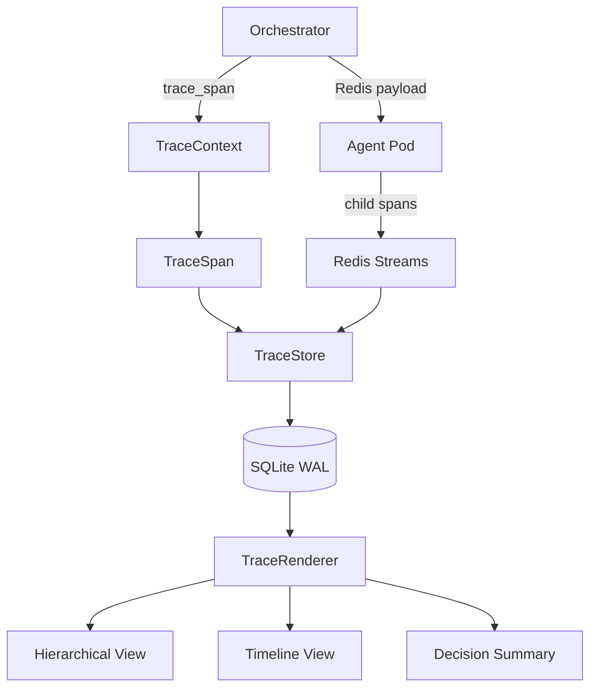

{/* ======================================================= */}
{/* TIER 1: CONCEPT                                         */}
{/* ======================================================= */}

## Problem & Context

AI agents make decisions that are invisible by default. You see the output -- a pull request, a Slack message, a deployed service -- but not the reasoning chain that produced it. When an agent picks the wrong tool, generates incorrect code, or misunderstands the task context, there is no trace of *why*. You are left reverse-engineering intent from output, which is slow, unreliable, and impossible to audit.

This is not just a debugging problem. Enterprise adoption of AI agents requires audit trails. Compliance teams ask: "What decisions did the agent make? What alternatives did it consider? Why did it pick this tool over that one? What data did it see?" Without tracing, the answer to every question is "we don't know."

Existing solutions do not fit. OpenTelemetry is designed for microservice request tracing -- it captures latency and HTTP status codes, not skill classification scores and reasoning chains. Langfuse and similar platforms add vendor dependency, SaaS costs, and send decision data outside the cluster. Building on top of either requires significant infrastructure: collectors, exporters, dashboards, retention policies.

We needed something different: a lightweight decision tracing system that captures classification scores, tool selections, LLM token costs, and reasoning chains with zero new dependencies and zero new infrastructure. It had to be disable-able via a single config flag (teams that cannot opt out will not opt in). It had to work across process boundaries -- from the controller that classifies and dispatches tasks to the Kubernetes agent pods that execute them. And it had to produce human-readable reports, because the primary consumer of trace data is an engineer reviewing agent decisions, not a monitoring dashboard.

The domain is AI agent observability for enterprise environments. Constraints: no new services to deploy, no new databases to manage, must integrate into the existing controller and agent pod architecture, and must add less than 1ms of latency to the request path.

## Technology Choices

- **SQLite with WAL mode** -- Trace storage with zero infrastructure. WAL (Write-Ahead Logging) mode allows concurrent reads during writes, which is critical because trace queries happen while new spans are being flushed. Chosen over PostgreSQL (already used for task state -- did not want tracing load competing for connections), Jaeger (requires its own deployment), and structured logs (loses span hierarchy and correlation).
- **W3C Trace Context compatible IDs** -- 32-character hex trace_id and 16-character hex span_id, matching the W3C Trace Context specification. Chosen for future migration compatibility -- when the system outgrows SQLite, migrating to any OpenTelemetry-compatible backend requires only swapping the storage layer, not reformatting every ID.
- **Python contextvars** -- In-process trace propagation using `contextvars.ContextVar`. Each async task inherits the current trace context without explicit parameter passing. Chosen over thread-local storage (does not propagate across async tasks) and explicit parameter threading (requires changing every function signature in the call chain).
- **Redis Streams** -- Cross-process span collection between the controller and agent pods. When the controller spawns an agent job, the trace_id and parent_span_id are included in the Redis task payload. The agent pod publishes child spans back through a Redis Stream that the controller consumes. Chosen because Redis is already a dependency for task handoff -- no new infrastructure.
- **Batched async writes** -- Spans are buffered in memory and flushed to SQLite in batches of 50 or every 5 seconds, whichever comes first. Chosen to minimize request-path overhead. Early prototypes with synchronous per-span writes added 15ms to the request path; batching reduced this to under 0.1ms per span creation.
- **Pure dataclasses (Pydantic-free)** -- The `TraceSpan` is a 22-field Python dataclass. No Pydantic validation overhead on the hot path. Input validation happens at the API boundary, not during span creation.

## Architecture Overview

The tracing system has five components that form a pipeline from span creation to human-readable reports:

1. **TraceSpan** -- A 22-field dataclass that is the atomic unit of tracing. Each span captures: the operation being performed (e.g., `TASK_CLASSIFIED`, `TOOL_INVOKED`), wall-clock timing, truncated input/output summaries, the agent's reasoning text, tool metadata (name, arguments, exit code), LLM metrics (model, input tokens, output tokens, estimated cost), error information, and correlation IDs linking it to its parent span and root trace.

2. **TraceStore** -- The persistence layer. An async SQLite writer with WAL mode, six indexes (trace_id, parent_span_id, operation_name, start_time, status, correlation), and a batched write buffer. Spans accumulate in a memory buffer and are flushed to disk in batches. A daily retention cleanup deletes spans older than the configured retention window (default: 30 days).

3. **TraceContext** -- The propagation layer. Uses Python `contextvars` to maintain the current trace_id and parent_span_id throughout an async call chain. Exposes a `trace_span()` async context manager that creates a new span, sets it as the current parent, and automatically records timing and status on exit.

4. **TraceRenderer** -- The reporting layer. Reads completed traces from the TraceStore and generates three views: a **hierarchical tree** showing parent-child span relationships with indentation, a **chronological timeline** showing all spans ordered by start time with duration bars, and a **decision summary** extracting only classification and selection spans into a concise "why did the agent do this?" report.

5. **Trace API** -- FastAPI endpoints and a CLI tool for querying traces. The API serves `GET /api/traces` (list recent), `GET /api/traces/{id}` (full trace), and `GET /api/traces/{id}/report?view=hierarchical|timeline|decision` (rendered report). The CLI (`python -m controller.tracing report <trace_id>`) produces the same output for terminal use.



{/* ======================================================= */}
{/* TIER 2: DOCUMENTED                                      */}
{/* ======================================================= */}

## System Context

The tracing system is embedded within the controller and extends into agent pods via Redis. External dependencies and trust boundaries:

- **SQLite** -- Trace storage file co-located with the controller pod. Accessed exclusively by the TraceStore. No external clients connect to this database. The file lives on an ephemeral volume by default, or a PVC for persistence across pod restarts.
- **Redis** -- Used for cross-process span transport. The controller writes trace_id and parent_span_id into the existing Redis task payload (no new Redis data structures for outbound). Agent pods publish completed child spans to a dedicated Redis Stream (`traces:spans`). The controller consumes this stream and routes spans to the TraceStore.
- **Orchestrator** -- The primary instrumentation site. Nine points in the orchestrator are instrumented with `trace_span()` calls: task received, task classified, skills injected, job spawned, job completed, error handled, retry initiated, human gate triggered, and final response delivered.
- **Agent Pods** -- Each agent pod receives trace context (trace_id, parent_span_id) in its Redis task payload. The agent runtime creates child spans for tool invocations, reasoning steps, and LLM calls. On completion, all child spans are published to the Redis Stream.
- **FastAPI** -- The existing controller API serves trace query endpoints. No separate service.
- **CLI** -- `python -m controller.tracing` provides `list`, `report`, and `search` subcommands. Runs in the same pod or via `kubectl exec`.

## Components

### TraceSpan

The 22-field dataclass at the core of the system:

- `span_id` (str): 16-character hex, generated via `secrets.token_hex(8)`
- `trace_id` (str): 32-character hex, generated via `secrets.token_hex(16)` for root spans, inherited for child spans
- `parent_span_id` (str | None): Links child spans to their parent
- `operation_name` (str): Enum-like string -- `TASK_RECEIVED`, `TASK_CLASSIFIED`, `SKILLS_INJECTED`, `JOB_SPAWNED`, `TOOL_INVOKED`, `LLM_CALL`, `REASONING_STEP`, `ERROR_HANDLED`, `RESPONSE_DELIVERED`
- `start_time` / `end_time` (float): `time.monotonic()` for duration, `datetime.utcnow()` for wall clock
- `duration_ms` (float): Computed on span close
- `input_summary` (str): Truncated to 500 characters. The task description, tool input, or prompt summary
- `output_summary` (str): Truncated to 500 characters. The result, tool output, or response summary
- `reasoning` (str): Free-text field capturing *why* the decision was made -- classification rationale, tool selection logic, error recovery strategy
- `tool_name` / `tool_args` / `tool_exit_code` (str | None, dict | None, int | None): Populated for `TOOL_INVOKED` spans
- `llm_model` / `llm_input_tokens` / `llm_output_tokens` / `llm_cost` (str | None, int | None, int | None, float | None): Populated for `LLM_CALL` spans
- `status` (str): `ok`, `error`, `timeout`
- `error_type` / `error_message` (str | None): Populated when status is `error`
- `tags` (dict): Arbitrary key-value metadata (e.g., `{"skill": "stripe-integration", "retry_count": "2"}`)
- `correlation_id` (str | None): Links the span to an external identifier (e.g., GitHub PR number, Slack thread ID)

The dataclass is frozen after creation. Fields that are set during the span lifecycle (end_time, duration_ms, output_summary, status) use `object.__setattr__` via the context manager -- the span is effectively mutable only during its active lifetime.

### TraceStore

SQLite-backed async storage with the following design:

- **WAL mode** enabled at connection time (`PRAGMA journal_mode=WAL`). Allows the TraceRenderer to read while the batch writer flushes.
- **Batch buffer**: An `asyncio.Queue` with max size 1000. The `trace_span()` context manager enqueues completed spans. A background `_flush_loop` task dequeues spans and writes them in batches.
- **Flush triggers**: Batch of 50 spans reached, or 5 seconds elapsed since last flush, whichever comes first. Under burst load, flushes happen more frequently (every 50 spans). Under low load, at most every 5 seconds.
- **Six indexes**: `idx_trace_id` (primary lookup), `idx_parent_span_id` (tree reconstruction), `idx_operation_name` (filter by type), `idx_start_time` (chronological queries), `idx_status` (error filtering), `idx_correlation_id` (external ID lookup).
- **Retention cleanup**: A daily task runs `DELETE FROM spans WHERE start_time < ?` with the configured retention window. Default: 30 days. Runs `VACUUM` after cleanup to reclaim disk space.
- **Schema**: Single `spans` table with columns matching TraceSpan fields. The `tags` column stores JSON. The `tool_args` column stores JSON.

### TraceContext

Propagation via `contextvars`:

```python
_current_trace_id: ContextVar[str | None] = ContextVar('trace_id', default=None)
_current_span_id: ContextVar[str | None] = ContextVar('span_id', default=None)
```

The `trace_span(operation_name, **kwargs)` async context manager:
1. Reads the current trace_id and span_id from contextvars
2. If no trace_id exists, generates a new one (this is a root span)
3. Creates a TraceSpan with the current span_id as parent_span_id
4. Sets the new span's span_id as the current span_id in contextvars
5. Yields the span for the caller to annotate (set reasoning, input_summary, etc.)
6. On exit: records end_time, computes duration_ms, sets status based on exception state, enqueues the span to the TraceStore buffer
7. Restores the previous span_id in contextvars

When tracing is disabled (`DF_TRACING_ENABLED=false`), `trace_span()` yields a no-op object. No spans are created, no contextvars are touched, no buffer writes occur.

### TraceRenderer

Three report views, each answering a different question:

- **Hierarchical view**: "What happened, structurally?" Reconstructs the span tree from parent_span_id links and renders it with indentation. Each line shows: operation name, duration, status, and a one-line summary. Useful for understanding the full execution flow.

- **Timeline view**: "What happened, chronologically?" Sorts all spans by start_time and renders them with ASCII duration bars relative to the trace start. Shows concurrent operations side by side. Useful for identifying bottlenecks and unexpected sequencing.

- **Decision summary**: "Why did the agent do what it did?" Filters to only `TASK_CLASSIFIED`, `SKILLS_INJECTED`, `TOOL_INVOKED`, and `REASONING_STEP` spans. Extracts the `reasoning` field from each and presents them in sequence. This is the view engineers use most often -- it answers "why did it pick these skills?" and "why did it call this tool?"

### Trace API

FastAPI endpoints mounted on the existing controller:

- `GET /api/traces?limit=50&status=error&since=2026-03-20` -- List traces with filtering
- `GET /api/traces/{trace_id}` -- Full trace with all spans
- `GET /api/traces/{trace_id}/report?view=decision` -- Rendered report in plain text or JSON
- `GET /api/traces/{trace_id}/spans?operation=TOOL_INVOKED` -- Filter spans within a trace

CLI equivalent: `python -m controller.tracing list --status error --since 2026-03-20`, `python -m controller.tracing report <trace_id> --view decision`, `python -m controller.tracing search --operation TOOL_INVOKED --since 2026-03-20`.

## Data Flow

A concrete walkthrough of tracing a task from receipt through agent execution to report generation:

1. A task arrives via webhook. The orchestrator's `handle_task()` method enters `trace_span("TASK_RECEIVED")`. This creates a root span with a new trace_id (`a]1b2c3d4e5f6...`, 32 hex chars) and span_id (`f7e8d9c0...`, 16 hex chars). The span's `input_summary` records the truncated task description.

2. The orchestrator calls the SkillClassifier. Inside the classifier, `trace_span("TASK_CLASSIFIED")` creates a child span. The `reasoning` field captures: "Tag extraction found ['kubernetes', 'deployment']. Phase 1 returned 8 candidates. Phase 2 ranked by embedding similarity. Top skill: k8s-deployment (0.94). Classification method: two-phase." The `tags` field stores all candidate scores as JSON.

3. Skills are injected into the agent configuration. `trace_span("SKILLS_INJECTED")` records which skills were selected, token budget allocation per skill, and whether any prompt fragments were truncated due to context limits.

4. The orchestrator spawns an agent job via the JobSpawner. The Redis task payload now includes `trace_id` and `parent_span_id` fields alongside the normal task data. `trace_span("JOB_SPAWNED")` records the job ID, container image, and resource limits.

5. The agent pod receives the task, extracts trace context from the Redis payload, and begins creating child spans. Each tool invocation (`TOOL_INVOKED`) captures the tool name, arguments, exit code, and execution duration. Each LLM call (`LLM_CALL`) captures the model name, token counts, and estimated cost. Each reasoning step (`REASONING_STEP`) captures the agent's internal chain-of-thought summary.

6. The agent completes. All child spans (typically 10-50 per task) are serialized and published to the `traces:spans` Redis Stream.

7. The controller's span collector consumes the Redis Stream, deserializes the child spans, and enqueues them into the TraceStore buffer. On the next flush cycle, they are written to SQLite alongside the controller-side spans.

8. An engineer queries the trace: `python -m controller.tracing report a1b2c3d4e5f6... --view decision`. The TraceRenderer reads all spans for this trace_id, filters to decision-relevant operations, and prints a sequential summary of what the agent decided and why.

{/* ======================================================= */}
{/* TIER 3: FIELD-TESTED                                    */}
{/* ======================================================= */}

## Architecture Decisions

### Decision 1: SQLite over Dedicated Tracing Backend

**Status:** Accepted

**Context:** The system needs a place to store trace spans -- potentially thousands per day -- with indexed queries by trace_id, time range, and status. The obvious choices are an existing tracing backend (Jaeger, Tempo, Langfuse) or a general-purpose database.

**Decision:** Use SQLite with WAL mode, co-located with the controller pod. Batched async writes for throughput. Six indexes for query patterns. Configurable retention with daily cleanup.

**Alternatives considered:**
- *OpenTelemetry Collector to Jaeger:* Rejected. Jaeger requires its own deployment (storage backend, query service, UI). For a system generating fewer than 10K spans/day, this is significant infrastructure overhead for minimal benefit. Additionally, Jaeger's span model is optimized for request tracing (latency, HTTP status), not decision tracing (classification scores, reasoning text).
- *Langfuse:* Rejected. SaaS dependency means trace data leaves the cluster. Enterprise compliance teams flagged this as unacceptable -- agent decision traces may contain customer data summaries. Self-hosted Langfuse requires PostgreSQL, Redis, and a web application deployment.
- *PostgreSQL:* Rejected. PostgreSQL is already used for task state and job tracking. Adding tracing writes (potentially bursty, 50 spans at once) to the same database risks connection pool contention and write latency spikes on the task management tables.
- *Structured logs only (JSON to stdout):* Rejected. Logs capture individual events but lose span hierarchy and correlation. Answering "show me all decisions for trace abc123" requires log aggregation, parsing, and manual correlation. With SQLite, it is a single indexed query.

**Consequences:** Zero new infrastructure to deploy or manage. The trace database is a single file that can be backed up with `cp`. Queries are sub-millisecond for indexed lookups. The trade-off is single-node storage -- trace data lives on one controller replica. For our agent tracing volumes (fewer than 10K spans/day), this is acceptable. If volumes grow 100x, migration to PostgreSQL or an OTel backend is straightforward because span IDs already use W3C format.

### Decision 2: W3C Trace IDs for Future Migration

**Status:** Accepted

**Context:** Trace IDs and span IDs are baked into every stored span, every cross-process payload, and every API response. Changing the ID format later requires migrating all stored data, updating all producers and consumers, and rebuilding all indexes. Choosing the wrong format now creates an expensive migration later.

**Decision:** Use W3C Trace Context compatible identifiers: 32-character lowercase hex for trace_id (128 bits), 16-character lowercase hex for span_id (64 bits). Generated via `secrets.token_hex()`.

**Alternatives considered:**
- *UUIDs:* Rejected. UUID format (`550e8400-e29b-41d4-a716-446655440000`) is not directly compatible with OpenTelemetry, which expects 32 hex characters without hyphens. Stripping hyphens on migration is trivial, but every OTel SDK, exporter, and UI expects the W3C format natively.
- *Sequential integers:* Rejected. No correlation semantics. Cannot propagate across process boundaries meaningfully. Cannot merge traces from multiple sources.
- *Custom format (e.g., `df-trace-{uuid}-{timestamp}`):* Rejected. Any custom format requires custom parsing on migration. The whole point of using a standard is avoiding future conversion logic.

**Consequences:** If the system migrates to Jaeger, Tempo, Datadog, or any OTel-compatible backend, the existing trace IDs are valid without conversion. Estimated migration effort: under 5 engineering days (swap the storage layer, keep the IDs). The cost of this decision is zero -- generating 32 hex characters is no more expensive than generating a UUID.

### Decision 3: Batched Async Writes

**Status:** Accepted

**Context:** Tracing must not degrade the performance of the system it observes. The orchestrator handles tasks on a latency-sensitive path -- adding even 5ms per span would be noticeable when a task flows through 9 instrumentation points (45ms total). Early prototypes with synchronous per-span SQLite writes added 1-2ms per span.

**Decision:** Buffer spans in an async queue. A background flush loop writes batches of up to 50 spans in a single SQLite transaction, or flushes after 5 seconds of inactivity. Span creation on the request path does only: dataclass instantiation, contextvars lookup, and queue enqueue -- all under 0.1ms.

**Alternatives considered:**
- *Synchronous write per span:* Rejected. Measured at 1-2ms per span in WAL mode. For a trace with 9 controller-side spans, that is 9-18ms added to the request path. Unacceptable.
- *Background thread with queue:* Rejected. Python's GIL causes contention between the async event loop and the background thread, especially during SQLite writes. The async flush loop avoids this entirely by staying on the event loop.
- *Write-ahead buffer to disk (append-only log):* Rejected. Adds complexity (log file rotation, crash recovery, replay logic) for minimal benefit. The in-memory buffer is simpler, and losing up to 50 spans on a hard crash is acceptable for tracing data.

**Consequences:** Request-path overhead is under 0.1ms per span (measured: dataclass creation ~40us, contextvars lookup ~5us, queue put ~10us). Batch write of 50 spans completes in ~2ms. The risk is data loss: if the process crashes between flushes, up to 50 spans and up to 5 seconds of trace data are lost. For tracing data (not business-critical), this is an acceptable trade-off.

## Trade-offs & Constraints

- **Single-node storage.** SQLite trace data lives on one controller replica. In a multi-replica deployment, each replica has its own trace file. Traces for a single task are complete on the replica that handled it (the controller is the single point of dispatch), but cross-replica queries require accessing multiple files. For our deployment model (single controller replica with failover, not load-balanced), this is not an issue.

- **Up to 50 spans lost on hard crash.** The in-memory buffer is not durable. A `kill -9` or OOM kill on the controller loses buffered spans. Tracing data is not mission-critical -- we accepted this rather than adding write-ahead logging complexity.

- **Redis dependency for cross-process tracing.** Agent pod spans are transported via Redis Streams. If Redis is unavailable, agent-side spans are lost but controller-side spans are still recorded. Partial traces are better than no traces. Redis is already required for task dispatch, so this is not a new dependency -- but tracing does add load to Redis (serialized span payloads, typically 1-5KB per task).

- **30-day retention limits historical analysis.** The default retention window deletes spans older than 30 days. For long-term analysis (e.g., "how did classification accuracy change over 6 months?"), organizations must export trace data to external storage (S3, GCS) before the retention window expires. We provide a `python -m controller.tracing export` command for this, but it is a manual step.

- **Decision tracing, not content tracing.** The system traces *decisions* (which skill was selected, which tool was invoked, what the reasoning was) but does not capture full LLM prompts and responses. Input and output summaries are truncated to 500 characters. This is a deliberate choice to limit sensitive data exposure and storage costs. Full prompt/response logging is a separate concern with different privacy and storage requirements.

## Failure Modes & Resilience

- **SQLite write failure.** If a batch write fails (disk full, file corruption, permissions error), the spans in that batch are dropped from the buffer. An error is logged with the batch size and error details. The flush loop continues -- subsequent batches may succeed if the issue was transient (e.g., momentary disk pressure). Tracing never blocks or crashes the request path.

- **Redis Streams unavailable.** Agent pods cannot publish child spans. The controller cannot consume them. Controller-side spans (task classification, skill injection, job lifecycle) are still recorded locally. The resulting trace is partial -- it shows what the controller decided but not what the agent did. An alert fires on missing agent spans (`traces.agent_spans.missing` metric).

- **Tracing disabled via config flag.** When `DF_TRACING_ENABLED=false`, the `trace_span()` context manager yields a lightweight no-op object. No spans are created, no contextvars are modified, no queue writes occur, no flush loop runs. The overhead is a single boolean check per instrumentation point (~1 nanosecond). This is critical for adoption -- teams that cannot disable tracing in performance-sensitive environments will not enable it anywhere.

- **SQLite file grows too large.** The retention cleanup task runs daily at a configurable time (default: 03:00 UTC). It deletes all spans older than the retention window and runs `VACUUM` to reclaim space. At 500 bytes per span and 10K spans/day, 30 days of retention is approximately 150MB. If cleanup fails to run (controller was down at the scheduled time), it runs on next startup.

- **Span buffer overflow under extreme burst.** The async queue has a max size of 1000. If the queue fills (1000 spans buffered without a flush), new spans are dropped with a warning log. In practice, the flush loop processes 50 spans every ~2ms, so the queue would need to receive 1000 spans faster than the flush can drain 50 -- this requires >25,000 spans/second, which is far beyond normal operating conditions.

## Security Model

- **Trace data locality.** All trace data is stored in SQLite on the controller pod's local filesystem. It never leaves the Kubernetes cluster. There is no external telemetry service, no SaaS upload, no phone-home.

- **API access control.** Trace query endpoints are served by the existing FastAPI controller, which is an internal Kubernetes service (ClusterIP). It is not exposed via Ingress or LoadBalancer. Access is limited to other pods in the cluster and engineers with `kubectl port-forward` or `kubectl exec` access.

- **Data minimization.** Input and output summaries are truncated to 500 characters. Full LLM prompts and responses are not stored. Tool arguments are stored but can be redacted per-tool via configuration (e.g., tools that handle credentials can be configured to store `{"args": "[REDACTED]"}` instead of actual values).

- **No built-in PII redaction.** The tracing system stores whatever the instrumentation points provide. If a task description contains customer names, email addresses, or other PII, that data appears in the trace. Organizations operating under GDPR or similar regulations must add a redaction layer between span creation and storage. We provide a `span_preprocessor` hook in the TraceStore configuration for this purpose, but no default implementation.

- **Full disable capability.** `DF_TRACING_ENABLED=false` ensures zero trace data is generated or stored. This is a hard off switch, not a sampling rate -- when disabled, there is no trace data to protect.

## Deployment Architecture

- **Controller pod.** The TraceStore, TraceContext, and Trace API all run within the existing controller process. No sidecar, no separate service, no additional container. The SQLite trace file is stored on the pod's filesystem.

- **Ephemeral vs persistent storage.** By default, the trace file is on an ephemeral volume and is lost on pod restart. For persistence, mount a PVC at the configured trace directory. The TraceStore creates the database file and tables on first run -- no migration step required.

- **Agent pods.** Each agent pod includes a lightweight tracing client (a single Python module) that reads trace context from the Redis task payload and publishes child spans to Redis Streams on completion. The client has zero dependencies beyond the standard library and the existing Redis connection.

- **CLI access.** The `python -m controller.tracing` CLI runs in the controller pod. For remote access: `kubectl exec -it <controller-pod> -- python -m controller.tracing report <trace_id> --view decision`. No additional tooling or port forwarding required for basic trace inspection.

- **No collector, no exporter, no dashboard.** The entire tracing infrastructure is: one SQLite file, one Redis Stream, one set of API endpoints on the existing service, and one CLI tool. Total new infrastructure: zero.

## Scale & Performance

- **Span creation overhead:** under 0.1ms per span. Breakdown: dataclass instantiation ~40 microseconds, contextvars lookup ~5 microseconds, async queue put ~10 microseconds. This is the cost on the request path.
- **Batch write (50 spans):** ~2ms. SQLite WAL mode allows the write to proceed without blocking concurrent reads. A single `INSERT INTO spans VALUES (?, ?, ...) ` statement per span within a transaction.
- **Trace query by ID:** under 1ms. The `idx_trace_id` index makes this a direct B-tree lookup regardless of total table size.
- **Report generation:** 10-50ms depending on span count and view type. The hierarchical view requires tree reconstruction (O(n) with a parent_id hash map). The timeline view requires a sort (O(n log n)). The decision summary requires a filter pass (O(n)). For a typical trace with 20-50 spans, all views complete in under 30ms.
- **Storage footprint:** ~500 bytes per span including indexes. At 10K spans/day, that is ~5MB/day, ~150MB for 30-day retention. SQLite handles databases up to 281TB; we will never approach this limit.
- **Retention cleanup:** under 100ms for a 30-day window. The `DELETE` uses the `idx_start_time` index. `VACUUM` takes longer (up to a few seconds for a 150MB file) but runs during the low-traffic cleanup window.

## Lessons Learned

- **Zero-dependency tracing is possible and practical.** The most common objection when we proposed tracing was "we need to set up OpenTelemetry first." That setup was estimated at 2-3 weeks (collector, Jaeger, dashboards, retention policies). SQLite-based tracing was running in production in 3 days. Do not let "we need the right infrastructure" block observability. Start capturing data now; migrate the storage layer later.

- **The decision summary is the most-used view.** We built three views expecting the timeline to be the most popular (it shows performance bottlenecks). In practice, engineers use the decision summary 80% of the time. The question they ask is not "what was slow?" but "why did it pick these skills?" and "why did it call `file_edit` instead of `terminal`?" Design your tracing reports around the questions people actually ask, not the questions you assume they will ask.

- **W3C trace IDs cost nothing now and save weeks later.** Generating `secrets.token_hex(16)` instead of `uuid4()` is zero additional effort. But when we evaluated migrating to Datadog's APM for the broader platform, the tracing team estimated that converting custom IDs to W3C format across stored data and live systems would take 2-3 weeks. Our traces were already compatible. Always use standard formats when the cost of compliance is zero.

- **Batched writes were essential.** The first prototype wrote each span synchronously. With 9 instrumentation points in the orchestrator, this added 15ms to every task. Engineers immediately complained about the latency and we almost killed the project. Switching to batched async writes reduced per-span overhead by 150x. Tracing systems that add noticeable latency to the systems they observe will be disabled, no matter how valuable the data.

- **The config flag is critical for adoption.** We made `DF_TRACING_ENABLED` a flag from day one. Two teams initially opted out due to concerns about performance in their high-throughput environments. After seeing the decision summary reports from other teams, both opted in within a month. If we had forced tracing on everyone from the start, the pushback would have killed the project. Let teams opt in when they see the value.

- **The Human Gate pattern depends on raw traces.** Our Human Gate workflow -- where a human reviewer examines the full session trace before an agent's changes are merged -- only works because traces capture raw decision data (classification scores, reasoning text, tool arguments), not AI-summarized data. An earlier iteration used the LLM to summarize its own reasoning into the trace. The summaries were fluent, confident, and occasionally wrong. Raw data is harder to read but impossible to hallucinate.
