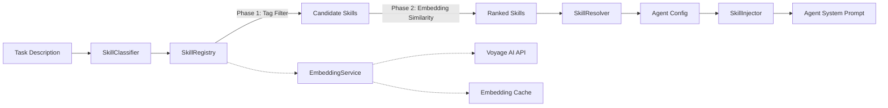

{/* ======================================================= */}
{/* TIER 1: CONCEPT                                         */}
{/* ======================================================= */}

## Problem & Context

AI agents that handle diverse engineering tasks -- frontend refactors, backend API design, infrastructure provisioning, database migrations -- need different capabilities for each domain. An agent working on a React component benefits from knowledge of component patterns and testing libraries. An agent debugging a Kubernetes deployment needs entirely different context: Helm chart structure, pod lifecycle, log analysis techniques.

Manually assigning skills to tasks does not scale. When you have 50 skills and 200 tasks per day, a human dispatcher becomes the bottleneck. Worse, humans miss non-obvious matches: a task described as "fix the checkout flow" might benefit from both a Stripe integration skill and a React state management skill, but a dispatcher focused on the word "checkout" might only assign the Stripe skill.

We needed automatic task-to-skill matching with three properties: **zero-deployment skill addition** (new skills are hot-loaded without restarting the system), **two-tier search accuracy** (fast tag filtering for obvious matches, semantic similarity for ambiguous ones), and **environment portability** (developers run the full skills system locally with SQLite, production uses pgvector for hardware-accelerated vector search).

The system operates in the domain of AI agent orchestration and capability management. Key constraints: the skills registry must work offline with SQLite (no PostgreSQL dependency for local development), must scale to 1000+ skills with sub-10ms search latency in production, and must support both exact keyword matching and conceptual similarity matching for tasks where the right skill is not obvious from keywords alone.

## Technology Choices

- **SQLite with FTS5** -- Local development skill storage and full-text search. Developers run the entire skills pipeline without installing PostgreSQL. Cosine similarity computed in Python for embedding search. Chosen over requiring PostgreSQL everywhere (developer experience) and in-memory-only storage (no persistence across restarts).
- **PostgreSQL 16 with pgvector** -- Production semantic search with HNSW indexing for approximate nearest neighbor queries. Chosen for hardware-accelerated cosine similarity and battle-tested operational tooling.
- **Voyage AI embeddings** -- Skill description vectorization using `voyage-code-3`. Chosen for strong performance on technical/code-related text. Embeddings are cached by content hash to avoid redundant API calls.
- **Python dataclasses** -- Skill definitions use frozen dataclasses with typed fields. No ORM -- raw SQL with parameterized queries for both SQLite and PostgreSQL backends.
- **Two-phase search pipeline** -- Phase 1 filters by tags using GIN indexes (PostgreSQL) or FTS5 (SQLite). Phase 2 ranks filtered candidates by embedding cosine similarity. This avoids running expensive vector search across the entire registry.

## Architecture Overview

The Skills Registry system follows a 5-component pipeline that transforms an incoming task description into a ranked set of relevant skills injected into the agent's runtime:

1. **SkillRegistry** -- The persistence layer. Handles CRUD operations for skill definitions and exposes two search methods: `search_by_tags()` for exact tag matching and `search_by_embedding()` for semantic similarity. Abstracts over SQLite (dev) and PostgreSQL+pgvector (production) via a Python Protocol class.

2. **SkillClassifier** -- The entry point for task-to-skill matching. Receives a task description, runs two-phase search (tags first, embeddings second), and returns a ranked list of skills with similarity scores. Configurable top-K threshold (default: 5).

3. **SkillResolver** -- Maps matched skills to concrete agent configurations. Each skill definition includes metadata about which container image, system prompt fragments, and tool configurations the agent needs. The resolver merges multiple skills into a single agent spec without conflicts.

4. **SkillInjector** -- Formats resolved skills into the payload that gets injected into the agent's environment. This includes system prompt additions, tool allowlists, and context documents. The injector ensures the agent sees a coherent prompt, not a jumble of concatenated skill fragments.

5. **EmbeddingService** -- Wraps the Voyage AI API with a content-hash-keyed cache. On first embedding request for a skill description, calls the API and stores the vector alongside its content hash. Subsequent requests for unchanged content return the cached vector instantly.

{/* ======================================================= */}
{/* TIER 2: DOCUMENTED                                      */}
{/* ======================================================= */}

## System Context

The skills system sits between the task orchestrator and the agent runtime. External dependencies and trust boundaries:

- **Voyage AI API** -- Called for embedding generation. Authenticated via API key stored in Kubernetes Secrets. The system degrades gracefully to tag-only search if the API is unreachable. Rate-limited to 300 requests/minute on the current plan.
- **PostgreSQL + pgvector** -- Production skill storage and vector search. The pgvector extension must be installed and enabled (`CREATE EXTENSION vector`). Accessed via asyncpg with connection pooling. HNSW index on the embedding column for approximate nearest neighbor search.
- **SQLite** -- Development skill storage. Database file co-located with the controller process. FTS5 virtual table for full-text tag search. Cosine similarity computed in Python using NumPy.
- **Orchestrator** -- The upstream system that receives tasks from webhooks and dispatches them. Calls `SkillClassifier.classify()` before spawning agent jobs.
- **JobSpawner** -- The downstream system that creates ephemeral agent containers. Receives the skills payload from the injector and includes it in the agent's environment.
- **Agent Runtime** -- Claude Code running in headless mode inside a Kubernetes pod. Receives skills as system prompt fragments and tool configurations at startup.

## Components

### SkillRegistry

The persistence and search layer. Each skill is stored as a record with: `id` (UUID), `name`, `description` (natural language, used for embedding), `tags` (list of strings), `embedding` (float vector, 1024 dimensions for voyage-code-3), `container_image` (Docker image reference), `prompt_fragment` (text injected into agent system prompt), `tool_allowlist` (list of tool names the skill enables), and `content_hash` (SHA-256 of description + tags, used for cache invalidation).

The registry exposes a `SkillBackend` Protocol with two implementations: `SQLiteBackend` and `PgvectorBackend`. Both implement `add()`, `remove()`, `update()`, `search_by_tags()`, and `search_by_embedding()`. The backend is selected at startup based on a `SKILLS_BACKEND` environment variable.

### SkillClassifier

Orchestrates the two-phase search. Given a task description, it first tokenizes the description and extracts candidate tags (using a simple keyword extraction heuristic -- no ML model, just TF-IDF against the known tag vocabulary). Phase 1 calls `search_by_tags()` with the extracted tags, returning up to 50 candidates. Phase 2 embeds the task description via `EmbeddingService`, then calls `search_by_embedding()` to rank the 50 candidates by cosine similarity. Returns the top-K results (default K=5) with similarity scores.

If Phase 1 returns fewer than 5 candidates, Phase 2 searches the entire registry instead of just the tag-filtered set. This handles tasks with poor tag coverage.

### SkillResolver

Takes the ranked skill list and produces a merged agent configuration. If two skills specify conflicting tool allowlists, the resolver unions them. If two skills specify conflicting prompt fragments, the resolver concatenates them with section headers. The resolver also validates that the specified container images exist in the registry (a lightweight HEAD request to the container registry).

### SkillInjector

Formats the merged configuration into the specific payload format the agent runtime expects. For Claude Code agents, this means: a `SYSTEM_PROMPT_ADDITIONS` environment variable containing the concatenated prompt fragments, a `TOOL_ALLOWLIST` environment variable containing the comma-separated tool names, and a mounted ConfigMap with any context documents referenced by the skills.

### EmbeddingService

Wraps `voyageai.Client` with caching. The cache is a dictionary keyed by content hash (SHA-256 of the input text). On cache miss, calls `client.embed()` with model `voyage-code-3` and stores the result. On cache hit, returns the stored vector. The cache is optionally backed by Redis for multi-replica deployments (each replica shares the same cache). Cache entries have no TTL -- invalidation is driven by content hash changes. If the Voyage AI API returns an error, the service raises a `EmbeddingUnavailable` exception that the classifier catches to fall back to tag-only search.

## Data Flow

A concrete walkthrough of a task flowing through the system:

1. A Slack message arrives: "Refactor the payment service to use the new Stripe SDK v4." The Orchestrator creates a `TaskRequest` and calls `SkillClassifier.classify(task_description)`.

2. The SkillClassifier extracts candidate tags from the description: `["stripe", "payment", "refactor", "sdk"]`. It calls `SkillRegistry.search_by_tags(["stripe", "payment", "refactor", "sdk"])`, which returns 12 candidate skills that match at least one tag.

3. The SkillClassifier calls `EmbeddingService.embed(task_description)`. The service computes `SHA-256("Refactor the payment service...")`, checks the cache, misses, calls Voyage AI, stores the resulting 1024-dimensional vector, and returns it.

4. The SkillClassifier calls `SkillRegistry.search_by_embedding(vector, candidates=12)`, which computes cosine similarity between the task vector and each candidate's cached embedding. Results are ranked by similarity score.

5. Top-5 skills are returned: `stripe-integration` (0.92), `python-refactoring` (0.87), `api-design` (0.81), `testing-patterns` (0.76), `payment-domain` (0.74).

6. The SkillResolver merges the 5 skills into a single agent configuration: container image `agent-python:3.12`, combined prompt fragments covering Stripe SDK patterns and refactoring techniques, tool allowlist including `file_edit`, `terminal`, `git`.

7. The SkillInjector formats this into environment variables and ConfigMaps. The JobSpawner creates a Kubernetes Job with these resources mounted.

{/* ======================================================= */}
{/* TIER 3: FIELD-TESTED                                    */}
{/* ======================================================= */}

## Architecture Decisions

### Decision 1: Two-Phase Search (Tags then Embeddings)

**Status:** Accepted

**Context:** The registry needs to match tasks to skills quickly and accurately. Pure embedding search means computing cosine similarity against every skill in the registry for every incoming task -- with 1000 skills and 200 tasks/day, that is 200,000 embedding comparisons per day, each requiring a vector dot product. Pure tag search is fast but misses semantically related skills that use different terminology.

**Decision:** Implement a two-phase pipeline. Phase 1 filters by tags using database indexes (GIN in PostgreSQL, FTS5 in SQLite), reducing candidates to a small set (typically 10-50). Phase 2 ranks this reduced set by embedding cosine similarity. If Phase 1 returns fewer than K results, Phase 2 falls back to searching the full registry.

**Alternatives considered:**
- *Embedding-only search:* Rejected. At 200ms per Voyage AI call plus vector comparison across 1000 skills, latency was unacceptable for synchronous task dispatch. API cost also scaled linearly with registry size.
- *Tag-only search:* Rejected. A task described as "modernize the authentication flow" should match a skill tagged `oauth` and `session-management`, but tag-only search requires the task to contain those exact terms.
- *FTS5 keyword search:* Rejected as primary method. Better than exact tag matching but still misses conceptual relationships. "Modernize auth" does not keyword-match "OAuth2 PKCE implementation."

**Consequences:** Well-tagged skills are found in under 1ms (Phase 1 alone). Ambiguous tasks still find relevant skills via semantic similarity but take 5-50ms depending on backend. The trade-off is maintaining both tags and embeddings for every skill -- tags for speed, embeddings for accuracy.

### Decision 2: Swappable Backend (SQLite vs pgvector)

**Status:** Accepted

**Context:** The orchestrator system is designed for local-first development. Engineers should be able to run the full pipeline on their laptop without Docker, PostgreSQL, or any external database. But production requires performant vector search across 1000+ skills with sub-10ms latency.

**Decision:** Define a `SkillBackend` Protocol in Python. Implement `SQLiteBackend` (uses FTS5 for tag search, NumPy for cosine similarity) and `PgvectorBackend` (uses GIN index for tag search, HNSW index for vector search). Backend selection is driven by environment variable at startup.

**Alternatives considered:**
- *Always require PostgreSQL:* Rejected. Setting up PostgreSQL with pgvector locally requires Docker or native installation, pgvector extension compilation, and database initialization. This is a 15-minute setup tax that discourages local development.
- *In-memory only:* Rejected. Skills must persist across controller restarts. Losing 1000 skill definitions on a process crash is unacceptable.

**Consequences:** Developers run `SKILLS_BACKEND=sqlite python controller.py` and everything works. Production runs `SKILLS_BACKEND=pgvector` with a managed PostgreSQL instance. The trade-off is maintaining two backend implementations -- but the Protocol interface is small (5 methods), so the maintenance burden is low.

### Decision 3: Cached Embeddings with Content Hash Invalidation

**Status:** Accepted

**Context:** Every call to `EmbeddingService.embed()` hits the Voyage AI API, adding ~200ms latency and $0.0001 per embedding. Skills change infrequently (a few updates per week), but tasks arrive constantly (200/day). Re-embedding unchanged skill descriptions on every search wastes time and money.

**Decision:** Cache embeddings in a dictionary keyed by `SHA-256(description + tags)`. On skill update, the content hash changes, triggering a cache miss and re-embedding on next access. Optionally back the cache with Redis for multi-replica deployments.

**Alternatives considered:**
- *Embed on every search:* Rejected. 200ms per embedding call is too slow for synchronous task dispatch. At 200 tasks/day with 50 candidate skills each, that is 10,000 API calls/day.
- *Pre-embed all skills on startup:* Rejected. Does not handle hot-added skills. A skill added via the admin API after startup would have no embedding until the next restart.

**Consequences:** First search involving a new or updated skill incurs a 200ms API call. All subsequent searches for unchanged skills use cached vectors (sub-millisecond lookup). Cache hit rate exceeds 95% in steady state because skills change far less frequently than tasks arrive. Cache invalidation is trivially correct -- if the content changes, the hash changes, and the old cache entry is never referenced again.

## Trade-offs & Constraints

- **Vendor dependency on Voyage AI.** Embedding quality and semantic matching accuracy are directly tied to the `voyage-code-3` model. Switching embedding providers requires re-embedding every skill in the registry and may change similarity rankings. Mitigation: the `EmbeddingService` interface is provider-agnostic, so swapping the underlying client is a single-file change.
- **SQLite cosine similarity performance.** Computing cosine similarity in Python with NumPy is approximately 10x slower than pgvector's HNSW index. For 50 candidates, this means ~50ms vs ~5ms. Acceptable for local development with a few concurrent users, but not for production with 200 tasks/day and potential burst traffic.
- **Tag maintenance burden.** Two-phase search depends on tags being accurate and current. Stale tags (e.g., a skill tagged `stripe-v3` when it now covers v4) degrade Phase 1 recall, forcing more work onto the slower Phase 2. Mitigation: admin API validates tags against a controlled vocabulary, and a weekly audit script flags skills whose tags have not been reviewed in 90 days.
- **Fixed top-K threshold.** The number of skills returned (default K=5) is configurable per deployment but not per task. A complex cross-domain task might benefit from 8 skills, while a simple single-domain task needs only 2. Returning 5 for both means occasional dilution or gaps. We accepted this trade-off to avoid the complexity of dynamic K selection.

## Failure Modes & Resilience

- **Voyage AI API unavailable.** The `EmbeddingService` raises `EmbeddingUnavailable`. The `SkillClassifier` catches this and falls back to tag-only search (Phase 1 results without Phase 2 re-ranking). A metric is emitted (`skills.embedding.fallback`) and an alert fires if the fallback rate exceeds 5% over 15 minutes. Tag-only search is a meaningful degradation, not a total failure -- well-tagged skills are still found.
- **No skills match the task.** If both phases return zero results above the similarity threshold (default: 0.5), the classifier returns an empty skill set. The agent runs with base capabilities only -- no additional prompt fragments or tool restrictions. This is by design: an unmatched task should not receive random skills.
- **Stale embedding cache.** Cannot happen by construction. The cache key is the content hash. If a skill's description or tags change, the hash changes, and the old cache entry becomes unreachable. No TTL-based expiration is needed.
- **pgvector extension missing in production.** The `PgvectorBackend` runs `SELECT * FROM pg_extension WHERE extname = 'vector'` at startup. If the extension is not installed, the backend raises a `ConfigurationError` with a clear message: "pgvector extension not found. Run: CREATE EXTENSION vector;". The controller fails fast rather than silently degrading.
- **Hot-added skill with poor tags.** A skill added with vague tags like `["general", "coding"]` will rarely surface in Phase 1. However, if its description is well-written ("Implements OAuth2 PKCE flow for single-page applications with token refresh and silent authentication"), Phase 2 embedding similarity will still match it for relevant tasks. Good descriptions compensate for bad tags; the reverse is not true.

## Security Model

- **API key protection.** The Voyage AI API key is stored in a Kubernetes Secret and injected as an environment variable. It is never logged, never included in error messages, and never passed to agent containers. The `EmbeddingService` redacts the key from any exception tracebacks.
- **Read-only skill access at runtime.** The `SkillRegistry` exposes search methods to the classifier but does not expose mutation methods. Skill creation, updates, and deletion are only available via a separate admin API that requires authentication (API key with `skills:write` scope). The runtime search path has no write access to the skills database.
- **Input sanitization.** Task descriptions are passed through a sanitization function before being used in tag extraction or embedding generation. The function strips control characters, truncates to 2000 characters, and removes any text matching patterns for common injection attempts (e.g., "ignore previous instructions"). The sanitized description is what gets embedded and searched.
- **SQLite file permissions.** In local development, the SQLite database file is created with `0600` permissions (owner read/write only). The controller process runs as a non-root user.

## Deployment Architecture

- **SQLite mode (local development).** The skill database is a single `.db` file stored alongside the controller. Zero additional infrastructure. The embedding cache is an in-memory Python dictionary. Suitable for single-developer use with up to ~100 skills.
- **pgvector mode (production).** PostgreSQL 16 with the pgvector extension, deployed as a managed instance (e.g., Cloud SQL, RDS). The skills table has a GIN index on the `tags` column and an HNSW index on the `embedding` column (`lists=100, m=16, ef_construction=200`). Connection pooling via asyncpg with min 2, max 10 connections.
- **Embedding cache in multi-replica deployments.** When running multiple controller replicas behind a load balancer, the in-memory cache is replaced with a Redis-backed cache. Each replica reads/writes to the same Redis instance, preventing redundant Voyage AI API calls. Redis entries are keyed by `skills:embedding:{content_hash}` with no TTL.
- **Skill hot-loading.** New skills are added via a `POST /admin/skills` endpoint. The endpoint validates the skill definition, computes the content hash, calls `EmbeddingService.embed()` to generate the vector, and inserts the record into the database. The new skill is immediately searchable -- no restart or cache warming required.

## Scale & Performance

- **Tag-based search (Phase 1):** under 1ms with PostgreSQL GIN index or SQLite FTS5. This phase eliminates 90%+ of candidates before the more expensive Phase 2.
- **Embedding search (Phase 2):** under 5ms with pgvector HNSW index over 50 candidates. ~50ms with SQLite + NumPy cosine similarity over 50 candidates. Scales linearly with candidate count in SQLite, sub-linearly with pgvector's approximate nearest neighbor.
- **Embedding generation:** ~200ms per skill via Voyage AI API. This cost is paid once per skill (on creation or update) and amortized across all subsequent searches via caching.
- **End-to-end classification latency:** under 10ms in production (cache hit path). ~250ms on first encounter with a new skill (cache miss, Voyage AI API call).
- **Registry capacity:** Tested with 1000 skills. pgvector HNSW index maintains sub-10ms search latency. SQLite backend is practical up to ~500 skills before Phase 2 latency exceeds 100ms.
- **Cache hit rate:** >95% in steady state. Skills are updated a few times per week; tasks arrive 200 times per day. The ratio heavily favors cache hits.

## Lessons Learned

- **Two-phase search was the right call.** Tag filtering eliminates 90% of candidates before the expensive embedding comparison. For well-tagged skills, Phase 1 alone is sufficient -- Phase 2 just confirms the ranking. The real value of Phase 2 is for ambiguous tasks where keywords do not capture the intent.
- **Caching embeddings by content hash is simple and effective.** We initially over-designed the cache with TTL-based expiration, LRU eviction, and background refresh. We replaced all of it with a content-hash key and no expiration. If the content changes, the hash changes, and the old entry is naturally abandoned. Total cache logic: 15 lines of Python.
- **The SQLite/pgvector split is essential for developer experience.** Before adding the SQLite backend, onboarding a new developer to the skills system required installing PostgreSQL, compiling pgvector, running migrations, and seeding test data. With SQLite, the command is `python controller.py` and the database is auto-created. Developer onboarding time for the skills system dropped from 45 minutes to 2 minutes.
- **Skill descriptions matter more than tags for semantic matching.** We initially invested heavily in a controlled tag vocabulary with hierarchical categories. It helped, but we found that a well-written 2-3 sentence skill description consistently outperformed extensive tagging for matching accuracy. Now we tell skill authors: "Write the description as if you are explaining to a developer when to use this skill. Tags are a bonus."
- **Top-K=5 is usually enough.** We experimented with K=3, 5, 8, and 10. At K=3, agents occasionally missed useful context. At K=8 and above, agents became unfocused -- the additional skills diluted the prompt without improving task completion rates. K=5 hit the sweet spot in our evaluations: high enough to capture cross-domain tasks, low enough to keep the agent focused.
