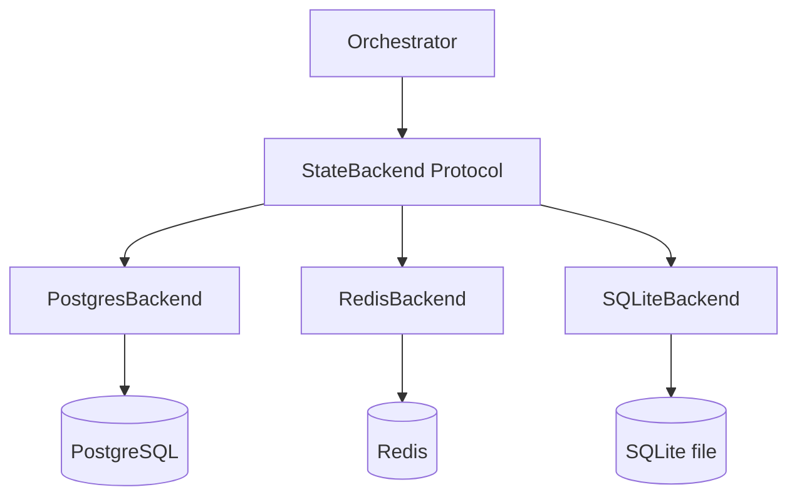

{/* ======================================================= */}
{/* TIER 1: CONCEPT                                         */}
{/* ======================================================= */}

## Problem & Context

Agent orchestration systems manage at least three distinct kinds of state, and conflating them causes real damage. You have durable state — task records, thread histories, conversation logs — that must survive process restarts, database failovers, and deployment rollouts. You have ephemeral state — result handoff between agents and controllers, short-lived coordination data — that exists for minutes, not months. And you have distributed locks — advisory mechanisms that prevent duplicate agent spawns when webhooks retry or controllers scale horizontally.

The naive approach is to put everything in PostgreSQL. Tasks, results, locks, message queues — all in one database. This works until you are polling Postgres every 5 seconds across 50 active threads to check for agent results, at which point your connection pool is exhausted and your DBA is asking pointed questions. The alternative extreme — everything in Redis — works until Redis restarts and your task records vanish.

The local development story makes this worse. Requiring developers to run PostgreSQL and Redis via Docker Compose just to test a state-related code path means most developers do not test state-related code paths. They mock the database, ship to staging, and discover issues there. A system that requires zero external dependencies for local development is not a luxury — it is a prerequisite for reliable iteration.

The constraints that shaped this architecture:

- **Right tool for each state type.** Durable state in a durable store. Ephemeral state in a fast, auto-expiring store. Do not force one store to do both jobs.
- **Swappable without code changes.** The orchestrator must not import `asyncpg` or `redis`. It depends on an interface, and the interface is satisfied by whatever backend is configured.
- **Advisory locks without additional infrastructure.** Distributed locking should use what you already have (PostgreSQL), not require deploying etcd or ZooKeeper.
- **Zero-dependency local development.** A developer clones the repo, runs the test suite, and everything works with SQLite. No Docker, no compose files, no "make sure Redis is running on port 6379."

This architecture was extracted from Ditto Factory, an agent orchestration platform where webhook retries, concurrent controller replicas, and multi-turn conversations made state management the single most failure-prone subsystem — until this design stabilized it.

## Technology Choices

- **Python Protocol (PEP 544) with `@runtime_checkable`** — Defines the 13-method `StateBackend` interface. Structural subtyping means any class implementing the methods is a valid backend without inheriting from a base class. Mypy catches missing methods at development time.
- **PostgreSQL 16 with asyncpg** — Production durable state. asyncpg's connection pooling (min=2, max=10) handles concurrent access efficiently. PostgreSQL's `pg_try_advisory_lock` provides non-blocking distributed locks without additional infrastructure.
- **Redis 7 with redis-py 5.0+** — Ephemeral state with native TTL support. Result keys expire after 3600 seconds, eliminating the need for manual cleanup. Connection pooling handles concurrent access.
- **SQLite with aiosqlite** — Local development backend. Simulates all 13 methods including advisory locks via a dedicated `locks` table with TTL-based expiry. Zero external dependencies — the database is a file in your project directory.
- **Pydantic v2** — Task and thread state serialization. Models validate state transitions (e.g., a task cannot move from `completed` back to `pending`) and produce clean JSON for storage.

## Architecture Overview

The system is built around three backend implementations behind one Protocol interface. Each backend is responsible for a different operational context, but all three satisfy the same 13-method contract.

1. **PostgresBackend** — Production durable state. Stores tasks, threads, and conversation history in relational tables. Advisory locks via `pg_try_advisory_lock` prevent duplicate agent spawns when multiple controller replicas process the same webhook. Locks are session-scoped: if the process crashes, PostgreSQL releases them automatically on disconnect.

2. **RedisBackend** — Ephemeral state for production. Handles result handoff between agents and controllers. When an agent completes a task, it writes the result to a Redis key with a 3600-second TTL. The controller polls this key every 5 seconds. Once retrieved, the result is written to the durable backend and the Redis key expires naturally.

3. **SQLiteBackend** — Local development. A single SQLite file simulates everything — tasks, threads, messages, results, and advisory locks. The locks table uses a `created_at` timestamp with TTL-based expiry, checked on each `try_lock` call. Not truly distributed, but for single-process development, it behaves identically.



The Orchestrator imports only the Protocol type. At startup, a factory function reads the `DF_STATE_BACKEND` environment variable and returns the appropriate implementation. The Orchestrator never knows which backend it received.

{/* ======================================================= */}
{/* TIER 2: DOCUMENTED                                      */}
{/* ======================================================= */}

## System Context

**External systems:**
- **PostgreSQL 16 (managed)** — Cloud SQL, RDS, or equivalent. Stores tasks, threads, conversation messages. Handles advisory locking for distributed coordination. Connected via asyncpg with SSL in production.
- **Redis 7 (managed)** — ElastiCache, Memorystore, or equivalent. Stores ephemeral result keys with TTLs. Connected via redis-py with optional TLS.

**Internal consumers:**
- **Orchestrator** — Core agent coordination logic. Creates tasks, manages threads, stores conversation history. Depends on StateBackend Protocol, never on a specific implementation.
- **JobSpawner** — Acquires advisory locks before spawning agent jobs. Prevents duplicate spawns from webhook retries or controller replica overlap.
- **JobMonitor** — Polls for agent results via `get_result()`. Updates durable task records when results arrive.
- **SafetyPipeline** — Reads conversation history via `get_messages()` for context-aware safety checks before agent output is delivered.

## Components

### StateBackend Protocol

The 13-method interface, grouped by concern:

**Task lifecycle** — CRUD operations on durable task records:
- `create_task(task: Task) -> Task` — Persists a new task. Returns the task with a generated ID.
- `get_task(task_id: str) -> Task | None` — Retrieves a task by ID. Returns `None` if not found.
- `update_task(task_id: str, updates: dict) -> Task` — Applies partial updates to a task (status, result, metadata).
- `list_tasks(filters: dict) -> list[Task]` — Queries tasks by status, thread, or date range.

**Thread management** — Conversation thread tracking:
- `get_or_create_thread(thread_id: str, metadata: dict) -> Thread` — Idempotent thread creation. If the thread exists, returns it unchanged.
- `get_thread(thread_id: str) -> Thread | None` — Retrieves thread metadata.
- `update_thread(thread_id: str, updates: dict) -> Thread` — Updates thread metadata (e.g., last activity timestamp).

**Conversation** — Message history for multi-turn support:
- `append_message(thread_id: str, message: Message) -> None` — Appends a message to the thread's conversation history.
- `get_messages(thread_id: str, limit: int = 50) -> list[Message]` — Retrieves the most recent messages for a thread. Default limit of 50 is configurable.

**Locking** — Distributed coordination to prevent duplicate work:
- `try_lock(lock_key: str) -> bool` — Non-blocking lock acquisition. Returns `True` if the lock was acquired, `False` if already held. In PostgreSQL, this maps to `pg_try_advisory_lock(hashtext(lock_key))`. In SQLite, this inserts into a `locks` table with conflict detection.
- `release_lock(lock_key: str) -> None` — Releases a previously acquired lock.

**Ephemeral** — Short-lived data for agent-to-controller handoff:
- `set_result(key: str, value: str, ttl: int = 3600) -> None` — Stores a result with automatic expiry. In Redis, this is a `SET` with `EX`. In SQLite, this is an insert with a `expires_at` timestamp.
- `get_result(key: str) -> str | None` — Retrieves a result if it exists and has not expired. Returns `None` otherwise.

### Backend Implementations

**PostgresBackend** uses asyncpg with parameterized queries for all operations. Task and thread tables use `thread_id` as an indexed column for efficient lookups. Advisory locks use `hashtext()` to convert string lock keys into the `bigint` that `pg_try_advisory_lock` expects. Connection pooling (min=2, max=10) prevents connection exhaustion under concurrent load.

**RedisBackend** implements only the ephemeral methods (`set_result`, `get_result`) in production usage. Task lifecycle and thread methods raise `NotImplementedError` — Redis is not used for durable state. This is enforced by configuration: the Orchestrator receives a PostgresBackend for durable operations and a RedisBackend for ephemeral operations.

**SQLiteBackend** implements all 13 methods in a single backend. This is the key simplification for local development — one backend, one file, zero dependencies. The `locks` table schema is `(lock_key TEXT PRIMARY KEY, acquired_at REAL, ttl_seconds INTEGER)`. The `try_lock` method first deletes expired locks, then attempts an `INSERT OR IGNORE`. If the insert affects one row, the lock was acquired.

## Data Flow

The complete lifecycle of a task, from webhook arrival to completion:

1. **Webhook arrives.** The Orchestrator receives a task request and immediately calls `try_lock(thread_id)`. This prevents a second controller replica (or a webhook retry) from spawning a duplicate agent for the same thread.

2. **Lock acquired.** If `try_lock` returns `True`, the Orchestrator calls `create_task()` to persist the task in the durable backend. The task is created with status `pending`.

3. **Task dispatched.** The JobSpawner launches the agent job (e.g., a Kubernetes Job). The task status is updated to `running` via `update_task()`.

4. **Agent completes.** The agent writes its result to the ephemeral backend via `set_result(thread_id, result_json, ttl=3600)`. The result is a JSON string containing the agent's output and metadata.

5. **Monitor polls.** The JobMonitor calls `get_result(thread_id)` every 5 seconds. Each call is a single Redis `GET` — minimal load. If the result is not yet available, `get_result` returns `None` and the monitor checks the Kubernetes job status as a fallback.

6. **Result found.** When `get_result` returns a value, the monitor calls `update_task()` to mark the durable task record as `completed` and store the result.

7. **Lock released.** `release_lock(thread_id)` frees the advisory lock, allowing future tasks on the same thread.

8. **Conversation stored.** Throughout this process, `append_message()` records each interaction — user request, agent response, error messages — building the multi-turn history that the SafetyPipeline and future agent invocations can reference.

## Architecture Decisions

### Decision 1: Protocol over Abstract Base Class

**Status:** Accepted

**Context:** The state backend needs to be swappable — PostgreSQL in production, SQLite in development, potentially other backends in the future. The choice is between inheritance-based (ABC) and structural (Protocol) interface contracts.

**Decision:** A 13-method Protocol with `@runtime_checkable` defines the StateBackend interface.

**Alternatives considered:**
- **Abstract Base Class** — Rejected because it forces single inheritance. A backend that also needs to inherit from a connection pool manager would require multiple inheritance gymnastics. ABCs also require explicit registration or subclassing — less Pythonic than structural subtyping.
- **Interface library (zope.interface)** — Rejected because it adds an external dependency for a problem the standard library solves.
- **Dict-based configuration** — Rejected because it provides no type safety. A misspelled method name would only be caught at runtime.

**Consequences:** Any class implementing 13 methods with correct signatures is a valid backend. Mypy catches mistakes at development time. No registration ceremony — you write a class, and it works. Trade-off: `@runtime_checkable` only verifies method existence, not signatures.

### Decision 2: Advisory Locks over Distributed Lock Service

**Status:** Accepted

**Context:** Webhook retries and multiple controller replicas can attempt to spawn agents for the same thread simultaneously. Without distributed locking, duplicate agent spawns waste compute and produce conflicting results.

**Decision:** Use PostgreSQL's `pg_try_advisory_lock` for production locking. Simulate advisory locks in SQLite via a `locks` table for development.

**Alternatives considered:**
- **Redis SETNX locks** — Rejected because it makes Redis a hard dependency for locking, not just ephemeral state. If Redis goes down, you cannot acquire locks — even though PostgreSQL (where the tasks live) is still healthy.
- **etcd / ZooKeeper** — Rejected due to operational overhead. A dedicated distributed lock service for a single lock use case is disproportionate.
- **Application-level mutex** — Rejected because it does not work across controller replicas. A `threading.Lock` protects one process, not two pods.

**Consequences:** Zero additional infrastructure — PostgreSQL is already required for durable state. `pg_try_advisory_lock` is non-blocking and returns immediately, making it ideal for the "check and proceed or skip" pattern. SQLite simulation works correctly for single-process development. Trade-off: lock semantics differ slightly between backends — PostgreSQL locks are session-scoped (auto-release on disconnect), while SQLite locks are TTL-scoped (expire after a configurable duration).

### Decision 3: Separate Durable and Ephemeral State

**Status:** Accepted

**Context:** Task records must survive restarts and be queryable by status, date, and thread. Agent results are short-lived coordination data that exists only to hand off a result from agent to controller.

**Decision:** PostgreSQL for durable state (tasks, threads, messages). Redis for ephemeral state (result handoff with TTLs).

**Alternatives considered:**
- **Everything in PostgreSQL** — Rejected because polling Postgres for results every 5 seconds across 50 threads adds 600 queries/minute to the database. PostgreSQL can handle it, but it is the wrong tool — you are using a durable ACID database as a message queue.
- **Everything in Redis** — Rejected because Redis persistence (RDB/AOF) is not a substitute for a relational database. Task queries by status, date range, or thread require secondary indexes that Redis does not provide without Lua scripting complexity.
- **Message queue (RabbitMQ/Kafka)** — Rejected because it adds a third infrastructure dependency. Redis with TTLs provides the same result-handoff semantics with simpler operations.

**Consequences:** Each store does what it is best at. Redis TTLs auto-clean stale results without cron jobs or manual intervention. PostgreSQL handles complex queries with standard SQL. Trade-off: two state systems to monitor, two connection pools to manage, two failure modes to handle.

## Trade-offs & Constraints

- **SQLite advisory locks are simulated, not distributed.** The `locks` table with TTL expiry works for single-process development but provides no protection if you run two controller instances locally. This is acceptable — local development does not need multi-replica coordination, and attempting to simulate it would add complexity without value.

- **Redis TTLs mean results are ephemeral by design.** A result expires after 3600 seconds (1 hour). If the monitor is down for longer than that, the result is lost. This is a deliberate choice — a result older than an hour is stale and should not be processed as if it were fresh. The monitor's fallback (checking Kubernetes job status directly) handles this edge case.

- **13 methods is a large interface.** The Protocol could theoretically be split into sub-protocols (`TaskStore`, `LockManager`, `EphemeralStore`). We chose not to because every consumer (Orchestrator, JobSpawner, JobMonitor) uses methods from multiple groups. Splitting would require passing multiple dependencies to each consumer, complicating initialization without improving cohesion.

- **Async-only interface excludes synchronous callers.** Every method is `async def`. This is a hard requirement — FastAPI is async-first, and asyncpg/aiosqlite are async libraries. Synchronous wrappers (`asyncio.run()`) would work but defeat the purpose. If you need synchronous state access, you need a different architecture.

{/* ======================================================= */}
{/* TIER 3: FIELD-TESTED                                    */}
{/* ======================================================= */}

## Failure Modes & Resilience

- **PostgreSQL unavailable.** The controller's `/health` endpoint checks database connectivity. If PostgreSQL is unreachable, the health check fails, Kubernetes marks the pod as unhealthy, and traffic is routed to healthy replicas. There is no silent degradation — durable state operations fail loudly with connection errors. This is intentional: creating a task that cannot be persisted is worse than refusing the request.

- **Redis unavailable.** `get_result()` returns `None`, which is the same response as "result not yet available." The JobMonitor falls back to checking Kubernetes job status directly. This is graceful degradation — the system continues functioning, just with slightly higher latency for result detection. `set_result()` failures are logged but do not crash the agent — the result is still available via K8s job status.

- **Advisory lock not released (process crash).** PostgreSQL session-scoped advisory locks are released automatically when the connection closes. If a controller pod crashes, its database connection drops, and all its locks are freed. No manual intervention required. For SQLite, the TTL-based expiry ensures locks do not persist indefinitely — a crashed process's lock expires after the configured TTL (default: 300 seconds).

- **SQLite file corruption.** The SQLiteBackend runs `PRAGMA integrity_check` on startup. If corruption is detected, the backend logs an error and recreates the database file. This is acceptable for development — losing local state is inconvenient, not catastrophic.

- **Concurrent lock attempts.** `pg_try_advisory_lock` is non-blocking — it returns `false` immediately if the lock is held. No deadlock is possible because the system uses `try_lock` (non-blocking) rather than `advisory_lock` (blocking). The caller checks the return value and either proceeds or skips the task.

## Security Model

- **Database credentials** are stored in Kubernetes Secrets and injected as environment variables at pod startup. They never appear in application logs, error messages, or stack traces.
- **PostgreSQL connections** use `sslmode=require` in production. The asyncpg pool is configured with the SSL context, and connections that fail SSL negotiation are rejected.
- **Redis connections** are authenticated with a password. TLS is optional but recommended for production deployments where Redis traffic crosses network boundaries.
- **SQLite file permissions** are restricted to the controller user (`chmod 600`). The file is created in the project directory, not in a world-readable temp directory.
- **No raw SQL.** All queries use asyncpg's parameterized query interface or aiosqlite's parameter substitution. SQL injection is structurally impossible — queries are never assembled via string concatenation.

## Deployment Architecture

**Production:** PostgreSQL 16 (managed service — Cloud SQL, RDS, or Aurora) plus Redis 7 (managed — ElastiCache, Memorystore). The controller connects to both at startup and runs health checks against each. Connection pooling: asyncpg pool (min=2, max=10), redis-py connection pool (max_connections=20).

**Local development:** SQLite file in the project directory (`./state.db`). Zero external dependencies. The developer sets `DF_STATE_BACKEND=sqlite` and everything works — tasks, threads, messages, results, locks. The same test suite runs against both backends via a pytest fixture that parameterizes the backend.

**Backend selection** happens at startup via the `DF_STATE_BACKEND` environment variable. A factory function reads the variable and returns the appropriate implementation:

```python
def create_backend(config: Settings) -> StateBackend:
    if config.state_backend == "postgres":
        return PostgresBackend(config.database_url)
    elif config.state_backend == "sqlite":
        return SQLiteBackend(config.sqlite_path)
    raise ValueError(f"Unknown backend: {config.state_backend}")
```

**Migrations** are SQL files applied at startup, guarded by `IF NOT EXISTS` clauses. PostgreSQL migrations create tables, indexes, and functions. SQLite migrations create the equivalent tables with compatible schemas. Both migration sets are idempotent — running them twice has no effect.

## Scale & Performance

Measured numbers from production and load testing:

| Metric | Value |
|--------|-------|
| Task CRUD (PostgreSQL with indexes) | p50: 1.2ms, p99: 1.8ms |
| Advisory lock acquire/release | p50: 0.4ms, p99: 0.9ms |
| Redis set_result / get_result | p50: 0.3ms, p99: 0.8ms |
| Result polling (per thread, every 5s) | 1 Redis GET per interval |
| Conversation history retrieval (50 msgs) | p50: 2.1ms, p99: 4.5ms |
| Concurrent lock contention test (100 attempts) | 0 deadlocks, 0 duplicate spawns |
| SQLite task CRUD (local dev) | p50: 0.8ms, p99: 2.2ms |

The result polling load scales linearly with active threads: 50 active threads means 10 Redis GETs per second (50 threads / 5-second interval). Redis handles this without measurable impact. PostgreSQL connection pool usage peaks at 6/10 connections during high-concurrency bursts.

## Lessons Learned

**The 13-method Protocol felt large at first, but every method earned its place.** Early in development, we considered splitting the Protocol into `TaskStore`, `ThreadStore`, `LockManager`, and `EphemeralStore`. The problem: every consumer needed methods from at least two groups, so we would have been passing four dependencies instead of one. A single Protocol with logical method grouping is simpler to wire up and reason about. Resist splitting prematurely — if every method is used, the interface is the right size.

**SQLite simulation of advisory locks is good enough for development.** The `locks` table with `INSERT OR IGNORE` and TTL-based expiry behaves identically to `pg_try_advisory_lock` in the single-process case. We spent zero time trying to make SQLite locks truly distributed — that would be solving a problem that does not exist in local development.

**Redis TTLs are a feature, not a limitation.** Early feedback suggested making result TTLs configurable per task or removing them entirely. We kept the 3600-second default because expired results are genuinely stale. An agent result from two hours ago should not be picked up and processed as if it just arrived. The TTL enforces temporal correctness.

**Separating durable and ephemeral state was the single most impactful architectural decision.** The first version stored everything in PostgreSQL, including result handoff. Polling Postgres every 5 seconds across 50 threads consumed 15% of the connection pool just for result checks. Moving result handoff to Redis eliminated this load entirely and reduced result detection latency from 5-second polling intervals to sub-millisecond Redis operations.

**The Protocol pattern made adding SQLite support a weekend project.** When we decided to eliminate the Docker Compose requirement for local development, implementing `SQLiteBackend` required writing one new file with 13 methods. No existing code changed — the Orchestrator, JobSpawner, and JobMonitor continued working without modification. This is the clearest validation of the architecture: a new backend is purely additive.

**Test both backends in CI.** The pytest suite runs against both PostgresBackend (via a test container) and SQLiteBackend. This catches behavioral differences between backends early. The one difference we discovered: PostgreSQL advisory locks are released on connection close, while SQLite locks persist until TTL expiry. This difference is documented in the Protocol's docstring and tested explicitly.
