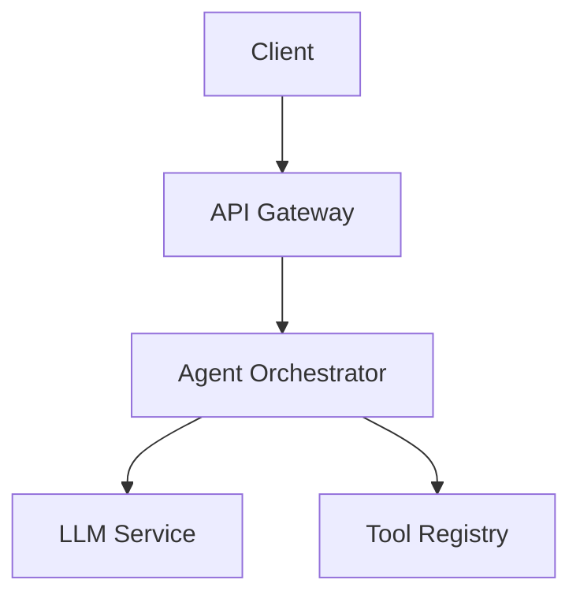

{/* ======================================================= */}
{/* TIER 1: CONCEPT -- Enough to understand the idea        */}
{/* Complete these sections to reach Concept tier.           */}
{/* Requires: problem statement (>=50 words), tech choices   */}
{/*   listed, license declared, >=1 diagram or visual.      */}
{/* ======================================================= */}

## Problem & Context

<!-- What business or technical problem does this architecture solve?
     What domain does it operate in? What constraints shaped the design?
     Be specific: name the users, the scale, and the pain points.
     (Minimum 50 words -- a couple of paragraphs is ideal.) -->

## Technology Choices

<!-- List primary languages, frameworks, databases, and infrastructure.
     Give a brief rationale for each choice -- why this over alternatives?
     Example:
       - **Python 3.12** -- team expertise, rich ML ecosystem
       - **PostgreSQL 15 on RDS** -- ACID guarantees needed for billing data
       - **Redis 7** -- sub-ms latency for session caching
-->

## Architecture Overview

<!-- High-level description of the system shape. Include at least one
     diagram: Mermaid code block, an image reference, or ASCII art.
     Describe the major pieces and how they connect at a glance. -->

<!-- Example Mermaid diagram:

-->

{/* ======================================================= */}
{/* TIER 2: DOCUMENTED -- Thorough enough to evaluate       */}
{/* Complete these to level up from Concept to Documented.   */}
{/* Requires: system context (external actors/integrations), */}
{/*   >=2 ADRs with rationale, data flow described,          */}
{/*   explicit trade-offs, >=1 quantified quality attribute. */}
{/* ======================================================= */}

## System Context

<!-- Who and what interacts with your system? List external actors,
     upstream/downstream APIs, third-party services, and user roles.
     A C4 Level 1 (System Context) diagram works great here.
     Example actors: end users, admin dashboard, payment gateway,
     monitoring stack, CI/CD pipeline. -->

## Components

<!-- Major building blocks and their responsibilities.
     For each component, state:
       - What it does (single responsibility)
       - What it depends on
       - What interface it exposes
     A C4 Level 2 (Container) diagram is helpful here. -->

## Data Flow

<!-- How data, requests, or messages move through the system.
     Describe at least one primary flow end-to-end.
     Example: "User sends a query -> API gateway authenticates ->
     Orchestrator selects tools -> LLM generates plan ->
     Tools execute -> Results aggregated -> Response returned."
     Sequence diagrams are encouraged. -->

## Architecture Decisions

<!-- Document at least 2 significant decisions in ADR format.
     Good ADR subjects: database choice, sync vs async communication,
     monolith vs microservices, authentication strategy, LLM provider. -->

### Decision 1: [Title]

**Status:** Accepted
**Context:** [What forces were at play? What problem triggered this decision?]
**Decision:** [What was decided and why]
**Alternatives considered:** [What else was evaluated and why it was rejected]
**Consequences:** [Positive, negative, and neutral impacts of this decision]

### Decision 2: [Title]

**Status:** Accepted
**Context:** [What forces were at play?]
**Decision:** [What was decided and why]
**Alternatives considered:** [What else was evaluated]
**Consequences:** [Impacts]

## Trade-offs & Constraints

<!-- What was explicitly sacrificed and why? Every architecture makes
     trade-offs -- name yours honestly. Include at least one trade-off
     with clear reasoning.
     Example: "We chose eventual consistency over strong consistency
     for cross-region replication, accepting a 2-second propagation
     delay to achieve 99.95% availability." -->

<!-- Include at least one quantified quality attribute.
     Example: "Target: p99 latency < 500ms for agent responses
     at 1,000 concurrent users." -->

{/* ======================================================= */}
{/* TIER 3: FIELD-TESTED -- Real-world evidence              */}
{/* Complete these to reach the highest tier.                */}
{/* Requires: failure modes & resilience, security model,   */}
{/*   deployment architecture, lessons learned, production   */}
{/*   metrics or scale evidence.                             */}
{/* ======================================================= */}

## Failure Modes & Resilience

<!-- What happens when things break? Describe at least one failure
     scenario with:
       - What fails (e.g., LLM provider timeout, database overload)
       - How the system detects it (health checks, circuit breakers)
       - How it recovers (retry, fallback, graceful degradation)
       - Impact on users during the failure
     Bonus: include a chaos engineering or incident anecdote. -->

## Security Model

<!-- Trust boundaries: where does trust change in your system?
     Authentication & authorization approach.
     Data protection: encryption at rest/in transit, PII handling.
     Threat considerations: what attacks have you considered?
     Agent-specific: how do you prevent prompt injection,
     tool misuse, or data exfiltration through agent actions? -->

## Deployment Architecture

<!-- How does this run in production?
     - Environment: cloud provider, region strategy, Kubernetes/serverless/VMs
     - CI/CD: pipeline stages, deployment strategy (blue-green, canary, rolling)
     - Infrastructure as code: Terraform, Pulumi, CDK, etc.
     - Observability: logging, metrics, tracing, alerting
     A deployment diagram is valuable here. -->

## Scale & Performance

<!-- Quantified operational characteristics from real usage:
     - Throughput: requests/sec, messages/min, jobs/hour
     - Latency: p50, p95, p99 response times
     - Data volume: storage size, growth rate
     - User counts: DAU, concurrent sessions
     - Cost: per-request cost, monthly infrastructure spend
     Show numbers, not adjectives. "10K req/s at p99 < 200ms"
     beats "highly scalable" every time. -->

## Lessons Learned

<!-- The most valuable section for the community. Share:
     - What worked well and you would repeat
     - What surprised you (good or bad)
     - What you would change with hindsight
     - Advice for someone building something similar
     Be honest -- battle scars are more useful than brochures. -->
